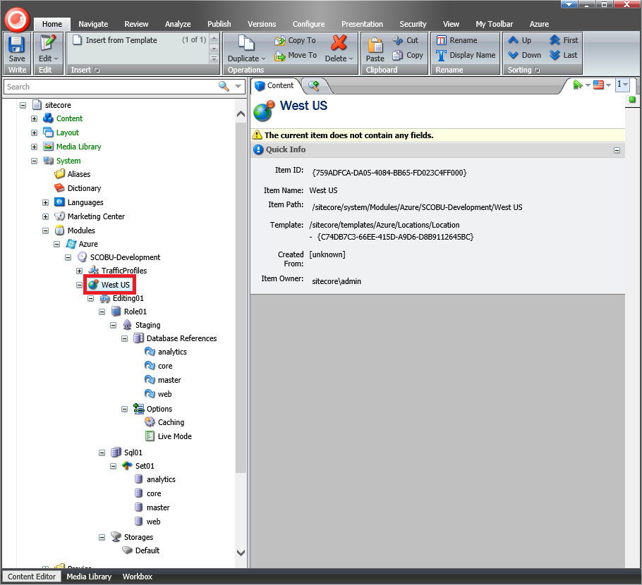
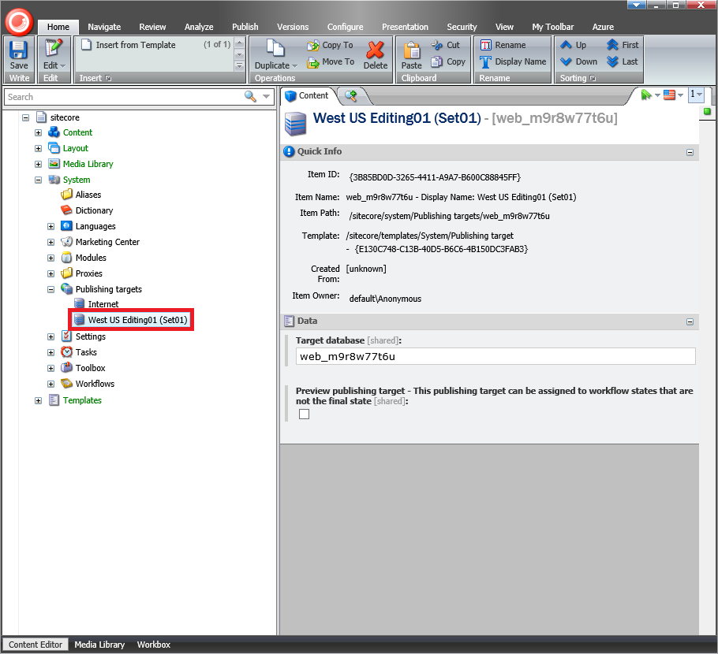
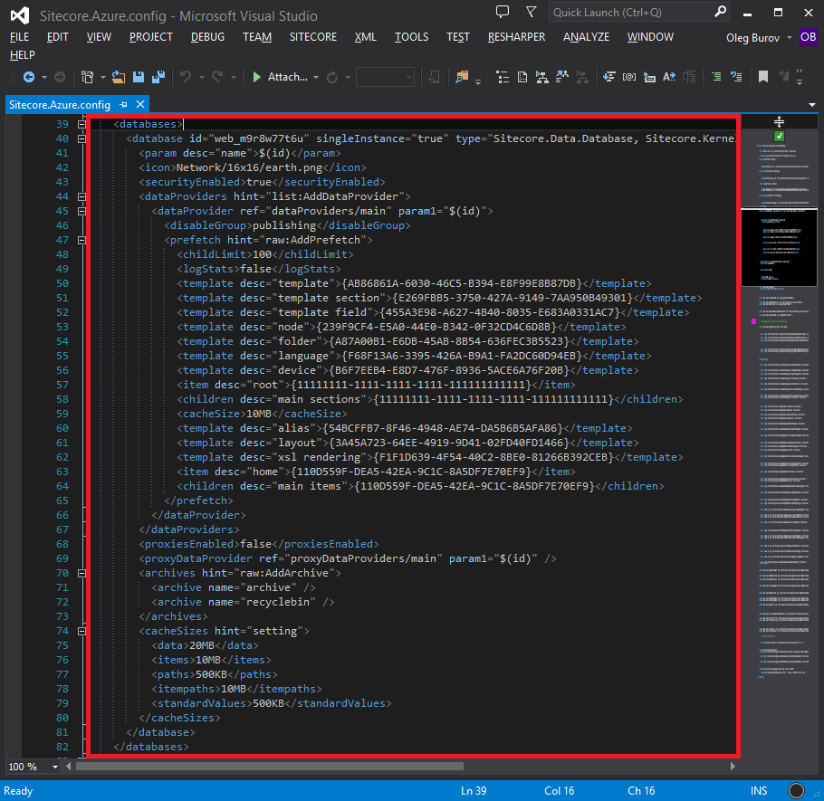
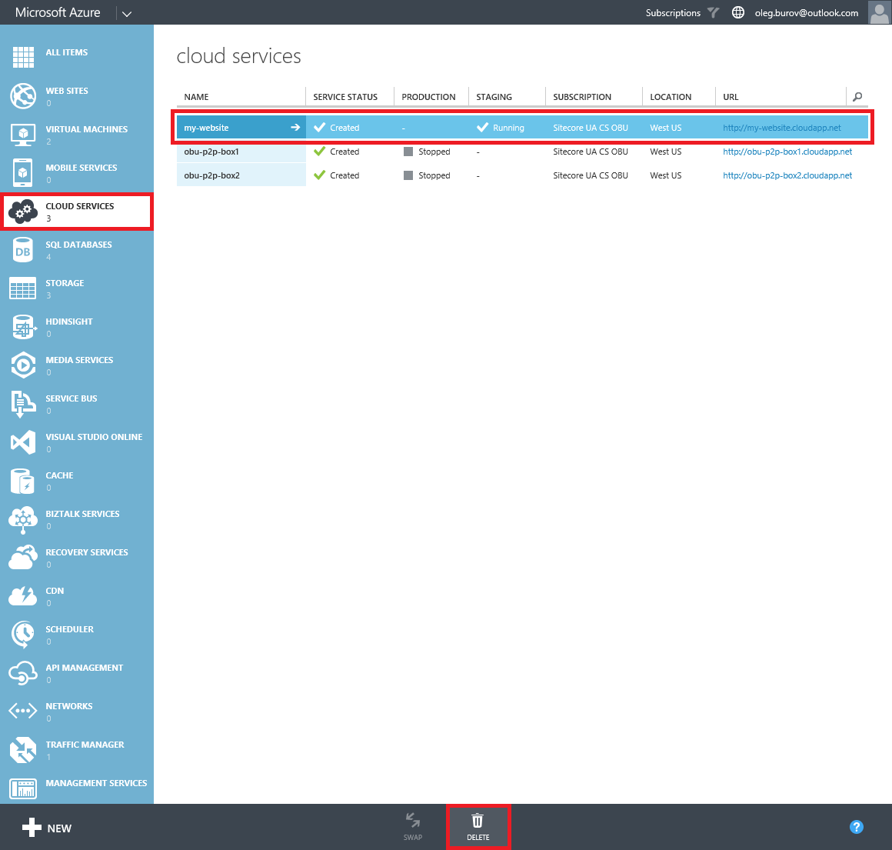
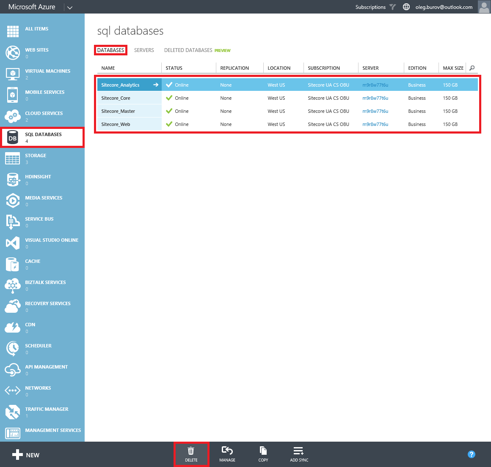
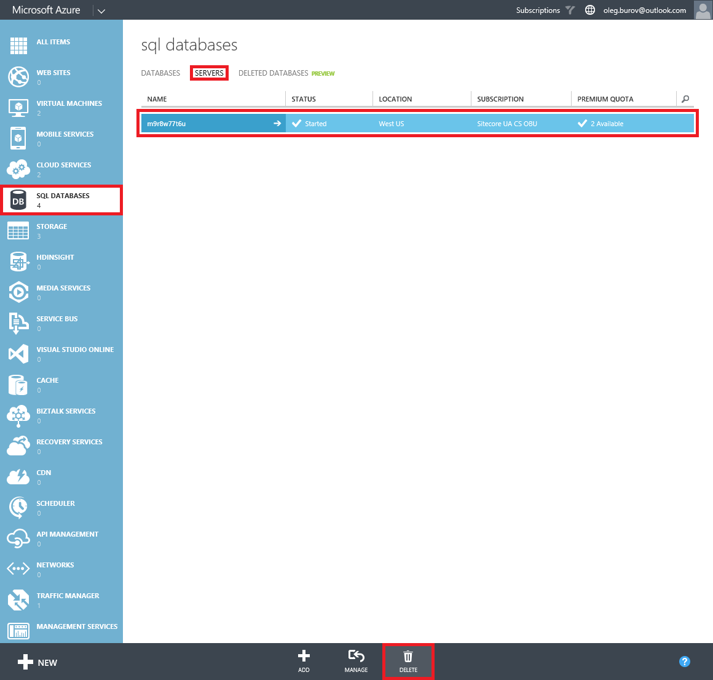
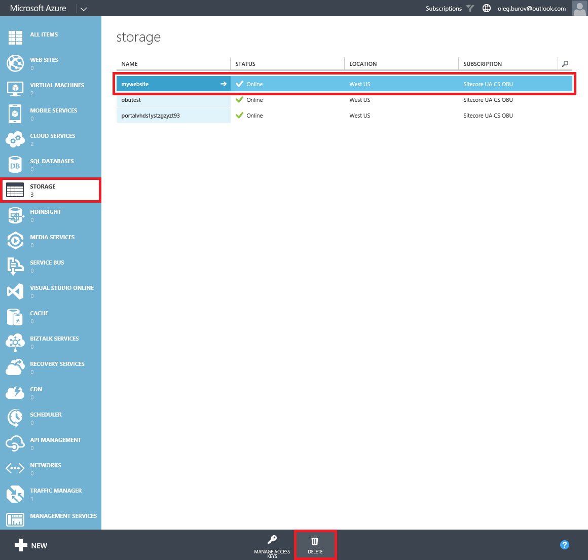
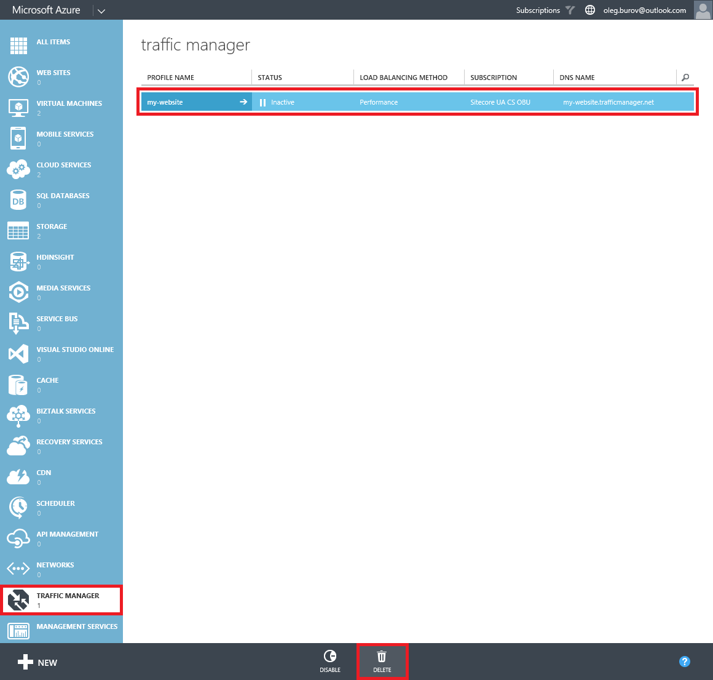
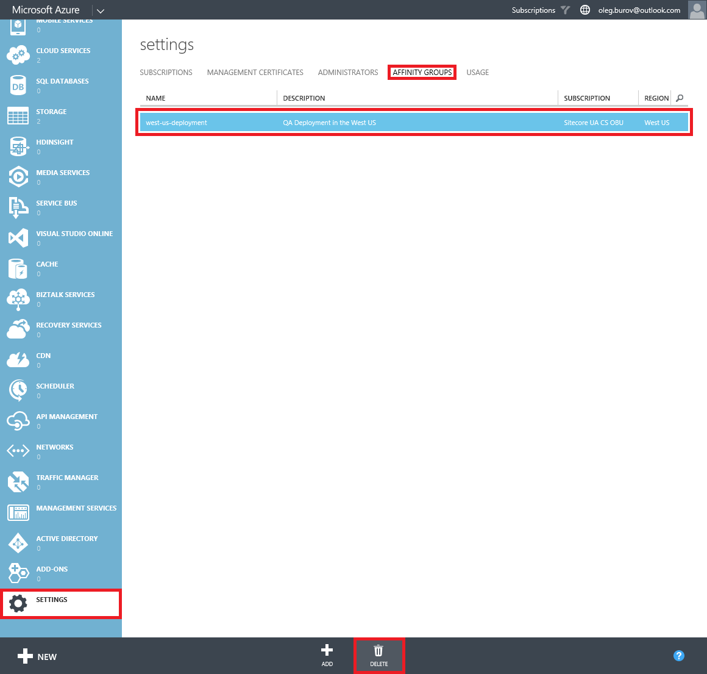

# How to clean up a failed Sitecore Azure deployment

The Sitecore Azure module automates the deployment process of a Sitecore solution to [Microsoft Azure](http://azure.microsoft.com/) cloud platform using the PaaS model. It keeps all routine work and many steps involved into the process behind the scenes.

However, a deployment may sometimes fail due to various reasons, such as network problems, web application restarts, etc. At the moment, the module does not provide an ability to clean up a failed deployment.

This article provides a list of techniques that can be used to clean up a failed Sitecore Azure deployment when not all of the deployment steps have been successfully completed.

## Solution

The recommended approach to clean up a failed deployment is as follows:

1. In the **Content Editor**, delete the `/sitecore/system/Modules/Azure/<Enviroment>/<Location>` item with its sub-items that represent a deployment.

   

2. In the **Content Editor**, delete the `/sitecore/system/Publishing targets/<Publishing target>` item that represents the `Web` database in the Microsoft Azure environment.

   

3. Modify the `\Website\App_Config\ConnectionStrings.config` file under the `connectionStrings` element. Delete a connection string that belongs to the `Web` database in the Microsoft Azure SQL Databases.

   

4. Modify the `\Website\App_Config\Include\Sitecore.Azure.config` file under the `\configuration\sitecore\databases` element. Delete a database definition that represents the `Web` database in the Microsoft Azure SQL Databases.
   
   

5. Log in to the **Microsoft Azure Management Portal** using the https://manage.windowsazure.com URL.

6. In the **Cloud Services** section, select a cloud service that represents the Sitecore deployment and click the **Delete** button in the ribbon at the bottom. Select the **Delete entire cloud service** option and click **Yes** to continue deleting operation.

   

7. In the **SQL Databases** section, one by one select SQL database that represents the `Core`, `Master`, `Web` and Analytics databases and click the **Delete** button in the ribbon. Select **Yes, Delete** to continue the deletion operation.

   

   > **Note:** By default, there are the `Core` and `Web` databases for the **Delivery Farm** and the `Core`, `Master` and `Web` databases for the **Editing Farm**. Additionally, if Sitecore DMS is enabled, there is the `Analytics` database for both the **Delivery Farm** and **Editing Farm**.
   
   > As an option, you can delete the entire SQL Server instance, if there are only Sitecore databases that belong to the deployment. In the **SQL Databases** section, switch to the **Servers** tab and select a server. Click the **Delete** button in the ribbon. Enter the server name to confirm the deletion.

   

8. In the **Storage** section, select a storage account and click the **Delete** button in the ribbon. Select **Yes** to continue the deletion operation.

   

9. \[Optional\] In the **Traffic Manager** section, select a traffic manager profile and click the **Delete** button in the ribbon. Select **Yes** to continue the deletion operation.

   

10. \[Optional\] In the **Settings** section, switch to the **Affinity Groups** tab and select an affinity group. Click the **Delete** button in the ribbon. Select **Yes** to continue the deletion operation.

   

   > **Note:** Steps 9 and 10 are optional since there might be other deployments that belong to the same traffic manager profile and affinity group. Therefore, you should not delete them.
