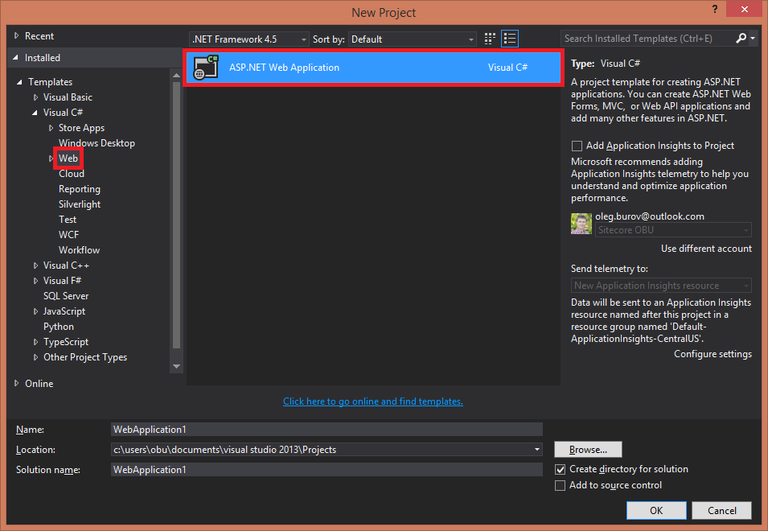
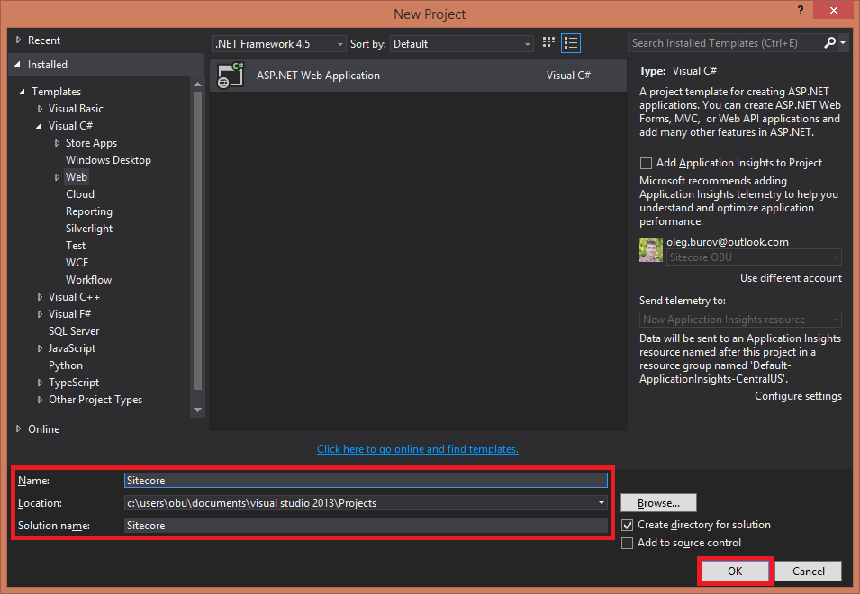
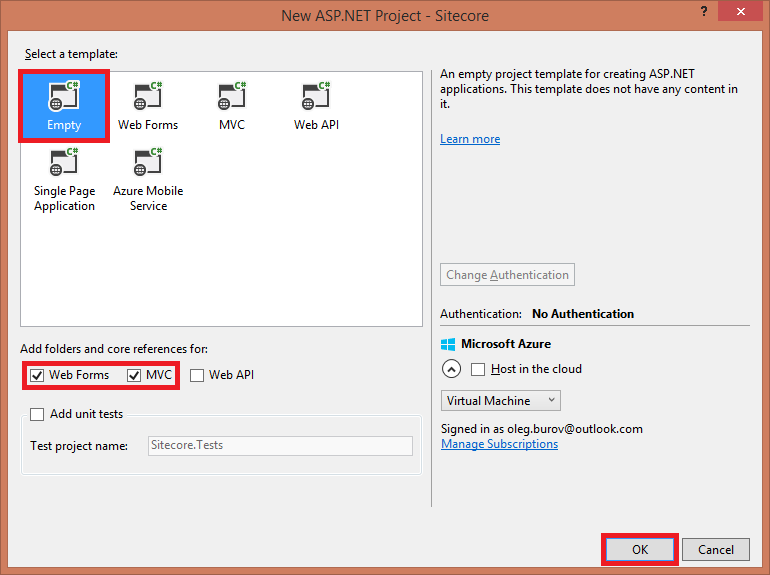
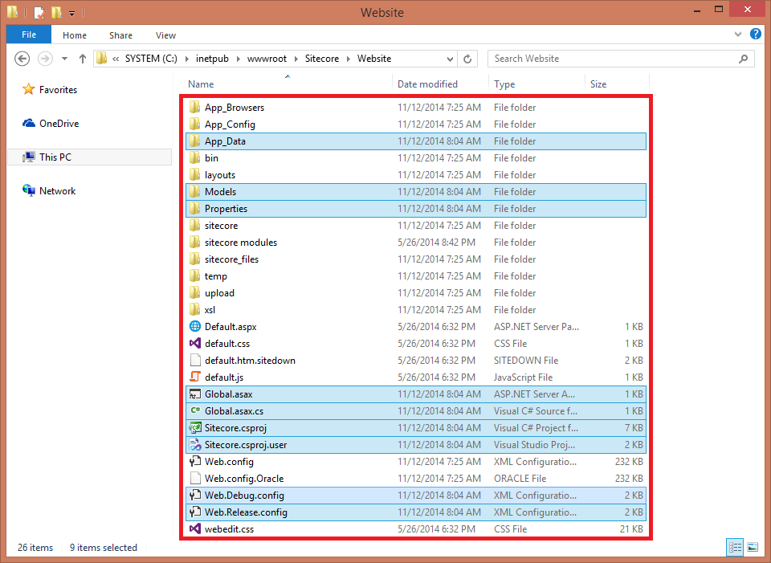
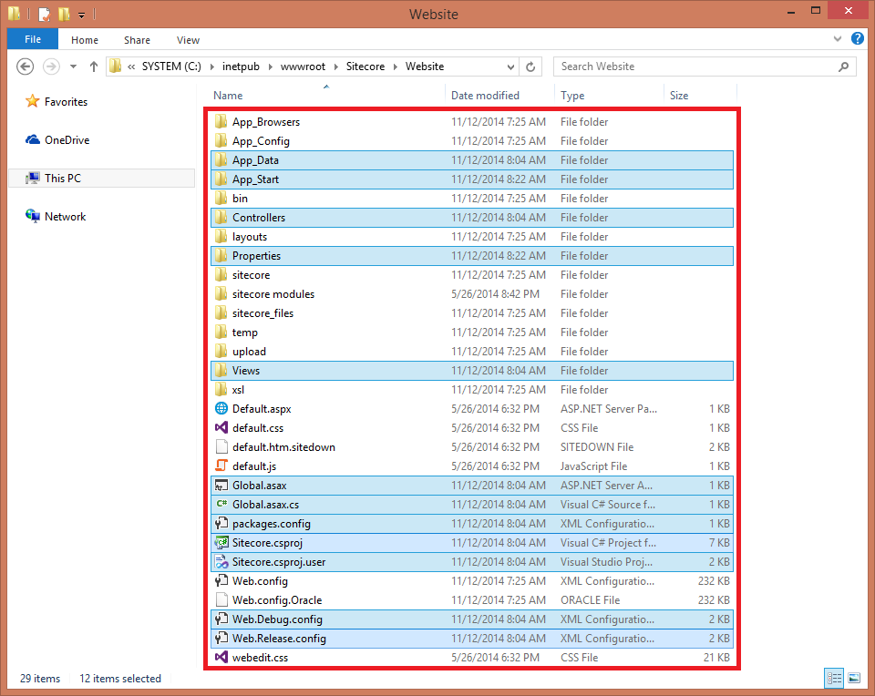
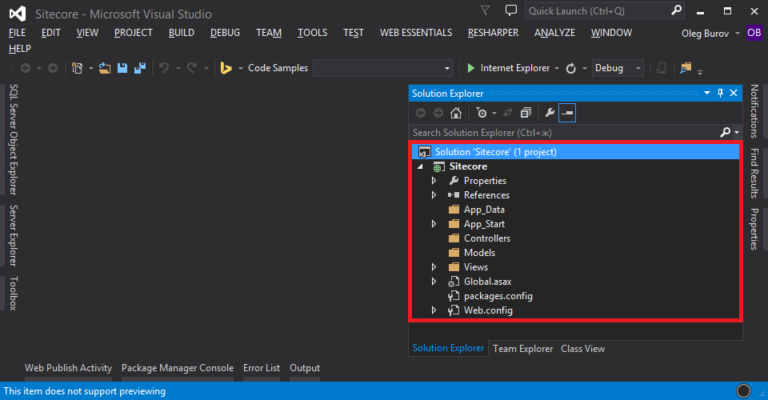
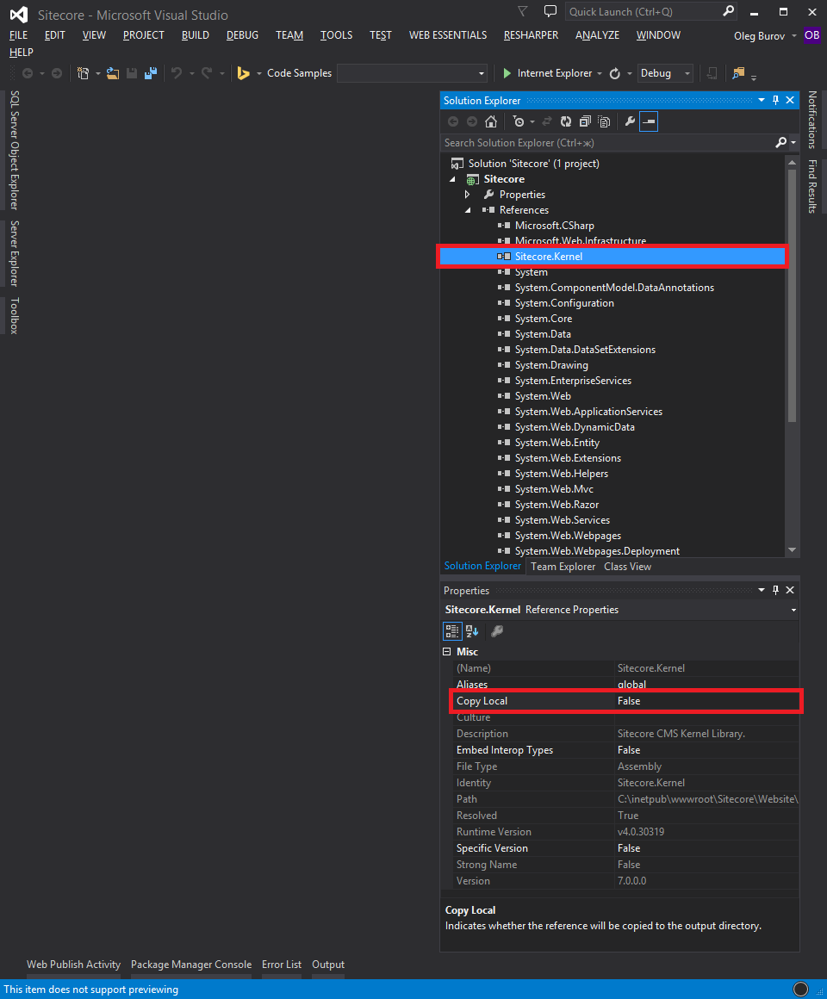

#How to Create ASP.NET Web Application Project

Sitecore supports the Visual Studio ASP.NET project model for Sitecore solutions using both the ASP.NET Web Forms and ASP.NET MVC applications. 

##Solution

The recommended approach to create an ASP.NET project in Visual Studio for Sitecore solution is as follows:

1. In the **Visual Studio**, on the ribbon, click File, and then select **New -> Project...** in the context menu. The **New Project** dialog box appears.

   

2. In the **New Project** dialog box, in the left panel, select the `/Installed/Templates/Visual C#/Web` item, and then select the **ASP.NET Web Application** template.

   

3. Fill in the **Name**, **Location** and **Solution** name fields and click the **OK** button. The **New ASP.NET Project** dialog box appears.

   

4. In the **New ASP.NET Project** dialog box, select the **Empty** template and select one of the following options, and then click the **OK** button:
   - **Web Forms** to build an ASP.NET Web Forms application
   - **MVC** to build an ASP.NET MVC application
   - Both **Web Forms** and **MVC** to build a hybrid ASP.NET application

   

5. Close the **Visual Studio** when the project is generated.

   

6. In the file system, go to the project location.

   

7. Copy the `Sitecore.sln` file to the `\<SitecoreSolutionRoot>` directory, where the `\Data`, `\Databases` and `\Website` ones are located.

   

8. Modify the `Sitecore.sln` file to change the path to `Sitecore.csproj` file to the `\Website` directory.
   
   ```xml
   Project("{FAE04EC0-301F-11D3-BF4B-00C04F79EFBC}") = "Sitecore", "Website\Sitecore.csproj", "{4B02E1CD-9DEE-47D2-B7C7-DBDC6AE2A329}"
   ```
9. Copy the following directories and files to the `\Website` directory.

   For an **ASP.NET Web Forms** application:
   - \App_Data
   - \Models
   - \Properties
   - \Global.asax
   - \Global.asax.cs
   - \Sitecore.csproj
   - \Sitecore.csproj.user
   - \Web.Debug.config
   - \Web.Release.config
  
   
  
   For an **ASP.NET MVC** application:
   - \App_Data
   - \App_Start
   - \Controllers
   - \Models
   - \Properties
   - \Views
   - \Global.asax
   - \Globalasax.cs
   - \packages.config
   - \Sitecore.csproj
   - \Sitecore.csproj.user
   - \Web.Debug.config
   - \Web.Release.config

   
   
   > **Important:** Modify both the `packages.config` and `\Views\Web.config` files to use the same version of ASP.NET MVC that Sitecore CMS supports. For example, for Sitecore CMS 7.2 that supports ASP.NET MVC 5.1, the version must be 5.1.0:
   
   ```xml
   <packages>
     <package id="Microsoft.AspNet.Mvc" version="5.1.0" targetFramework="net45" />
     <package id="Microsoft.AspNet.Razor" version="3.1.0" targetFramework="net45" />
     <package id="Microsoft.AspNet.WebPages" version="3.1.0" targetFramework="net45" />
     <package id="Microsoft.Web.Infrastructure" version="1.0.0.0" targetFramework="net45" />
   </packages>
   ```
   
   ```xml
   <configuration>
   ...
     <system.web.webPages.razor>
       <host factoryType="System.Web.Mvc.MvcWebRazorHostFactory, System.Web.Mvc, Version=5.1.0.0, Culture=neutral, PublicKeyToken=31BF3856AD364E35" />
       ...
     </system.web.webPages.razor>
   ...
   </configuration>
   ```

10. In the **Visual Studio**, open the `\<SitecoreSolutionRoot>\Sitecore.sln` solution.

   

11. In the **Solution Explorer**, add a reference to the `Sitecore.Kernel.dll` assembly and set the **Copy Local** property to **False**.

   

12. In the **Solution Explorer**, right-click the `Global.asax` item, and then click **View Code** in the context menu to modify the **Global** class as shown below:
    
    ```c#
    using System;
    ...
    
    namespace Sitecore
    {
      public class Global : Sitecore.Web.Application
      {
        protected void Application_Start(object sender, EventArgs e)
        {
          ...
        }
      }
    }
    ```
    
13. In the **Solution Explorer**, double-click the `\App_Start\RouteConfig.cs` item, and then comment out the default ASP.NET MVC route:
    
    ```c#
    using System;
    ...      
    namespace Sitecore
    {
      public class RouteConfig
      {
        public static void RegisterRoutes(RouteCollection routes)
        {
          ...            
          //routes.MapRoute(
          //  name: "Default",
          //  url: "{controller}/{action}/{id}",
          //  defaults: new { controller = "Home", action = "Index", id = UrlParameter.Optional }
          //);
        }
      }
    }
    ```  
   
   > **Note:** The default ASP.NET MVC route is not valid for using with Sitecore MVC. See the `Mvc.IllegalRoutes` setting in the `\App_Config\Include\Sitecore.Mvc.config` file for more details.