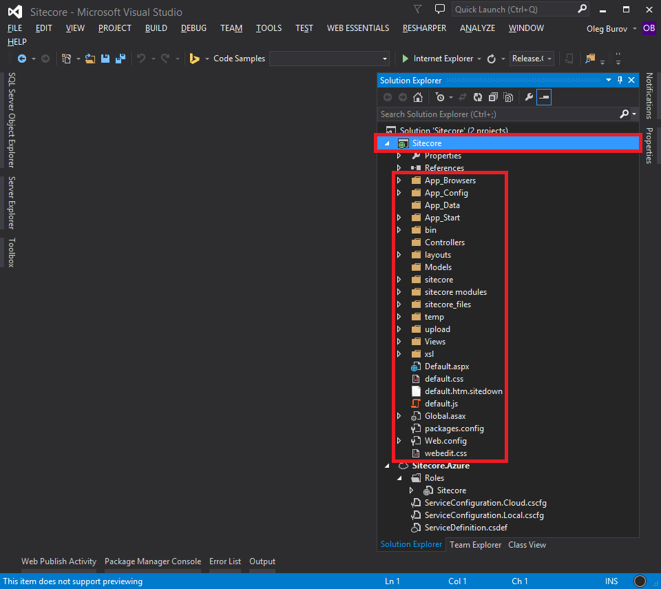
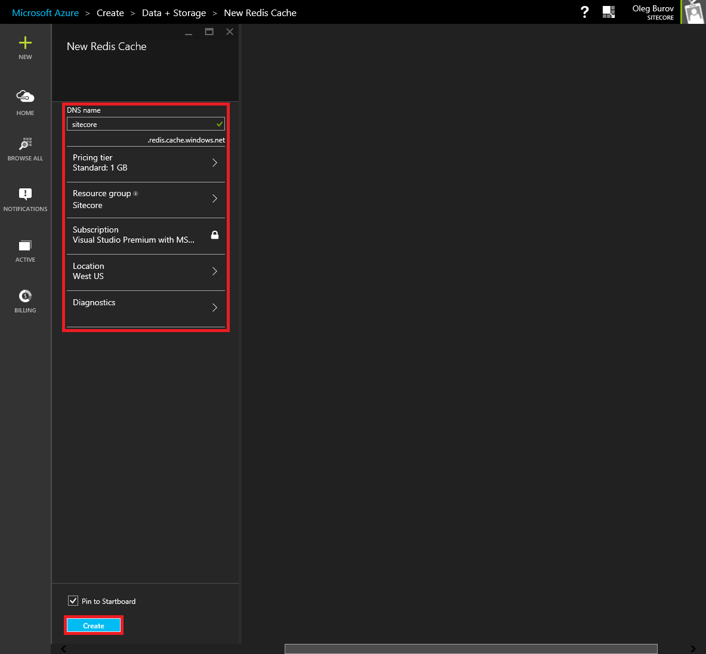
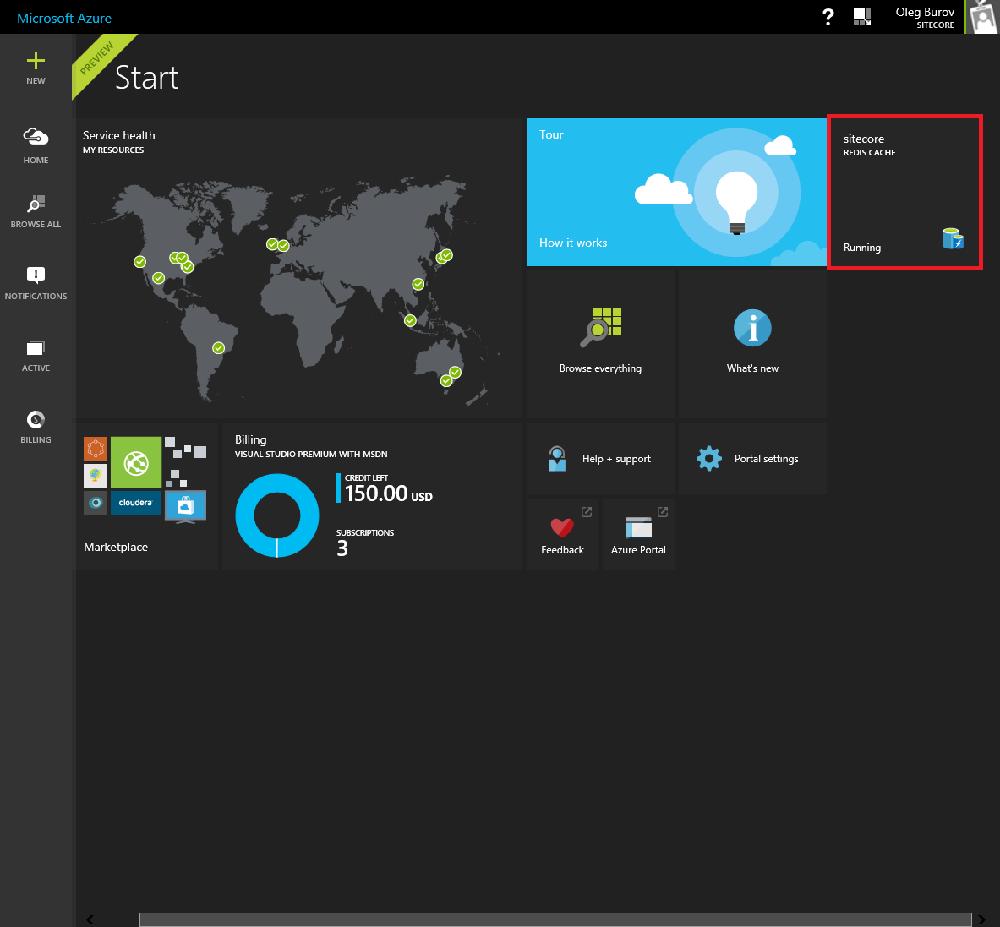
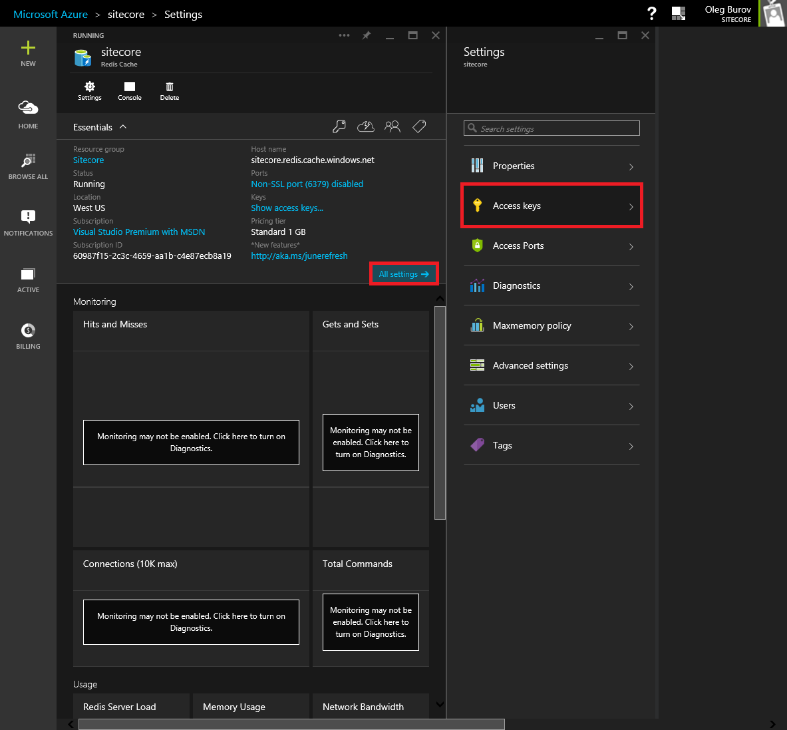

#How to deploy Sitecore 7.2 solution to Microsoft Azure Cloud Service using Visual Studio

After developing a Sitecore solution in Visual Studio, it is possible to manually publish this solution to the Microsoft Azure Cloud Platform.

This article provides a list of techniques that can be used to deploy a Sitecore solution to Microsoft Azure using Microsoft Visual Studio.

**Important:** It is highly recommended that you get acquainted with the [Compute Hosting Options Provided by Azure](http://azure.microsoft.com/en-us/documentation/articles/fundamentals-application-models/) and [Microsoft Azure Fundamentals](http://www.microsoftvirtualacademy.com/colleges/Azure-fundamentals) before following the instructions in this article.

**Requirements:**
  - [Azure Cloud Service](https://msdn.microsoft.com/en-us/library/azure/jj155995.aspx)
  - [Azure Storage](https://msdn.microsoft.com/en-us/library/azure/gg433040.aspx)
  - [Azure SQL Database](https://msdn.microsoft.com/en-us/library/azure/ee336279.aspx)
  - [Azure Redis Cache](https://msdn.microsoft.com/en-us/library/azure/dn690523.aspx)
- Microsoft Visual Studio 2013
- Microsoft Azure SDK 2.5.1 for .NET
- Microsoft Azure Tool for Visual Studio 2013 
- Microsoft SQL Server Management Studio 2014
- Sitecore CMS and DMS 7.2 rev. 150408 (7.2 Update-4) or higher

**Note:** To download the latest version of the Microsoft Azure SDK and Tool for Visual Studio, follow this link: http://azure.microsoft.com/en-us/downloads/

##Instructions

The recommended approach to deploy a Sitecore solution to Microsoft Azure using Visual Studio is as follows:

1. In the **Visual Studio**, right-click the **ASP.NET Web Application** project, and then click **Convert -> Convert to Microsoft Cloud Service Project** in the context menu. The **Azure Cloud Service** project is generated.

   
   
   **Note:** For information on creating an ASP.NET Web Application project for Sitecore, see the section [How To Create ASP.NET Web Application Project](#how-to-create-aspnet-web-application-project).
   
2. Modify both the **Web.Debug.config** and **Web.Release.config** files to replace the `connectionStrings` element. Add the following Web.config transformation to use connect strings that target the **Azure SQL Database** service:
   
   ```xml
   <configuration>
   ...
     <connectionStrings xdt:Transform="Replace">
       <add name="core" connectionString="Server=tcp:{server-name}.database.windows.net,1433;Database=Sitecore.Core;User ID={server-admin-login}@{server-name};Password={password};Trusted_Connection=False;Encrypt=True" />
       <add name="master" connectionString="Server=tcp:{server-name}.database.windows.net,1433;Database=Sitecore.Master;User ID={server-admin-login}@{server-name};Password={password};Trusted_Connection=False;Encrypt=True" />
       <add name="web" connectionString="Server=tcp:{server-name}.database.windows.net,1433;Database=Sitecore.Web;User ID={server-admin-login}@{server-name};Password={password};Trusted_Connection=False;Encrypt=True" />
       <add name="analytics" connectionString="Server=tcp:{server-name}.database.windows.net,1433;Database=Sitecore.Analytics;User ID={server-admin-login}@{server-name};Password={password};Trusted_Connection=False;Encrypt=True" />
     </connectionStrings>
   ...
   </configuration>
   ```
   
   **Note:** For more details about Web.config transformation syntax for Web Project Deployment using Visual Studio, see the MSDN website: http://msdn.microsoft.com/en-us/library/dd465326.aspx

   **Note:** For information on deploying Sitecore databases to Azure, see the section [How To Deploy Sitecore Databases](#how-to-deploy-sitecore-databases).

3. Modify both the `Web.Debug.config` and `Web.Release.config` files to set the path of the `dataFolder` Sitecore variable. Add the following Web.config transformation to set the `\Website\App_Data` directory as a data folder:
   
   ```xml
   <configuration>
   ...
     <sitecore>
       <sc.variable name="dataFolder" 
                    value="/App_Data"
                    xdt:Transform="SetAttributes(value)"
                    xdt:Locator="Match(name)" />
     </sitecore>
   ...
   </configuration>
   ```
   
4. Copy the contents of the `\Data` directory to the `\Website\App_Data` directory.

   
   
5. Clean the following directories to avoid overloading the **Cloud Service** package:
   - \App_Data\MediaCache
   - \App_Data\debug
   - \App_Data\diagnostics
   - \App_Data\indexes
   - \App_Data\logs
   - \App_Data\packages
   - \App_Data\viewstate
   - \temp
   - \upload

   
   
   **Note:** The Cloud Service package is limited in size and cannot be more than 1.5 GB. Therefore, the directories listed above must be cleaned to reduce the package size.
   
6. Place the [Startup.cmd](./media/how-to-deploy-sitecore-72-solution-to-microsoft-azure-cloud-service-using-visual-studio/Startup.cmd) file in the `\bin` directory.

   

7. Modify the `ServiceDefinition.csdef` file under the `WebRole` element. Add the following task definition to execute the Startup.cmd file:

   ```xml
   <ServiceDefinition>
     <WebRole>
     ...
       <Startup>
         <Task commandLine="Startup.cmd" executionContext="elevated" taskType="simple" />
       </Startup>
     ...
     </WebRole>
   </ServiceDefinition>
   ```

8. Include the default Sitecore files, directories and subdirectories from the `\Website` directory into the project:

   For a **Content Delivery** environment:
   - \App_Browsers
   - \App_Config
   - \App_Data
   - \bin
   - \layouts
   - \sitecore\services
   - \sitecore modules
   - \sitecore_files
   - \temp
   - \upload
   - \xsl
   - \Default.aspx
   - \default.css
   - \default.htm.sitedown
   - \default.js
   - \Web.config
   - \webedit.css

   For a **Content Management** environment, additionally include the following directories and files:
   - \sitecore\admin
   - \sitecore\Copyright
   - \sitecore\debug
   - \sitecore\images
   - \sitecore\login
   - \sitecore\portal
   - \sitecore\samples
   - \sitecore\shell
   - \sitecore\blocked.aspx
   - \sitecore\default.aspx
   - \sitecore\no.css

   

   **Important:** Visual Studio may freeze when including the entire `\sitecore\shell` directory at once because it contains a lot of files and subdirectories. Try to split all the subdirectories into portions, and then add them one by one.

9. For the **Content Management** environment, modify both the `Web.Debug.config` and `Web.Release.config` files to patch the `Caching.CacheViewState`, `PageStateStore` and `ViewStateStore` Sitecore settings:

   ```xml
   <configuration>
   ...  
     <sitecore>
       <settings>
         <setting name="Caching.CacheViewState" 
                  value="false" 
                  xdt:Transform="SetAttributes(value)"
                  xdt:Locator="Match(name)" />
         <setting name="PageStateStore" 
                  value="Sitecore.Web.UI.DatabasePageStateStore, Sitecore.Kernel"
                  xdt:Transform="SetAttributes(value)"
                  xdt:Locator="Match(name)" />
         <setting name="ViewStateStore" 
                  value="Sitecore.Data.DataProviders.DatabaseViewStateStore,Sitecore.Kernel"
                  xdt:Transform="SetAttributes(value)"
                  xdt:Locator="Match(name)" />
       </settings>    
     </sitecore>
   ...
   </configuration>
   ```

10. Log in to the **Microsoft Azure Portal** using the https://portal.azure.com URL.

   

11. In the **Jumpbar**, click the **New** button, then select the **Data + Storage** section and click the **Redis Cache** button. The **New Redis Cache** blade appears.

   

12. In the **New Redis Cache** blade, fill in the **DNS name** field and configure the other section if needed, then click the **Create** button.

   

13. In the **Startboard**, click on the **my-website** Redis Cache tile.

   

14. In the **my-website Redis Cache** blade, click the **All settings** button. The **Settings** blade appears.

   
   
15. In the **Settings** blade, click on the **Properties** section and copy the **Host Name** field value.

   

16. In the **Settings** blade, click on the **Access keys** section and copy the **Primary** field value.

   

17. In the **Visual Studio**, click **Tools** -> **NuGet Package Manager** -> **Packages Manager Console**. Run the following command in the **Package Manager Console** window against the **ASP.NET Web Application** project:
    
   ```
   Install-Package Microsoft.Web.RedisSessionStateProvider
   ```
    
18. Modify the `Web.config` file under the `\configuration\system.web\sessionState mode="Custom"` element. Move the entire `sessionState mode="Custom"` element from the `Web.config` file to both the `Web.Debug.config` and `Web.Release.config` files:   

   ```xml
   <configuration>
   ...
     <system.web>
       <sessionState mode="Custom" customProvider="MySessionStateStore">
       ...
       </sessionState>
     </system.web>
   </configuration>
   ```

19. Modify both the `Web.Debug.config` and `Web.Release.config` files under the `\configuration\system.web\sessionState\providers\add` element. Insert the copied Azure Redis Cache Host Name into the `host` attribute and Primary Access Key into the `accessKey` one. Additionally, insert the `xdt:Transorm` attribute into the `sessionState` element:   

   ```xml
   <configuration>
   ...
     <system.web>
       <sessionState mode="Custom" customProvider="MySessionStateStore" xdt:Transform="Replace>
         <providers>
           <add name="MySessionStateStore" type="Microsoft.Web.Redis.RedisSessionStateProvider" host="{host-name}.redis.cache.windows.net" accessKey="{primary-access-key}" ssl="true" />
         </providers>
       </sessionState>
     </system.web>
   </configuration>
   ```

   **Note:** For information on configuring ASP.NET Session State Provider for Azure Redis Cache, see the MSDN website: https://msdn.microsoft.com/en-us/library/azure/dn690522.aspx

20. In the **Visual Studio**, click **Tools** -> **NuGet Package Manager** -> **Packages Manager Console**. Run the following command in the **Package Manager Console** window against the **ASP.NET Web Application** project:

   ```xml
   Install-Package Sitecore.Azure.Diagnostics
   ```

21. In the **Visual Studio**, in the **Solution Explorer**, right-click on `Web.Debug.config` and then `Web.Release.config` files. Use the **Preview Transform** command in the context menu to check that all transformations look correct as you expect them to be.

   

22. Right-click on the **Azure Cloud Service** project and click the **Set as StartUp Project** in the context menu. Use Azure Computer Emulator to run and debug Sitecore instance locally.

   

   **Note:** For information regarding using Emulator Express to Run and Debug a Cloud Service Locally, see the MSDN website: https://msdn.microsoft.com/library/azure/dn339018.aspx

23. Right-click the **Azure Cloud Service** project and click the **Publish...**  in the context menu. The **Publishing Azure Application** dialog box appears.

   

24. In the **Publishing Azure Application** dialog box, publish the Sitecore solution to the Microsoft Azure Cloud Platform.

   
   
   **Note:** For the basic information about the Publish Azure Application Wizard, see the MSDN website: http://msdn.microsoft.com/en-us/library/azure/hh535756.aspx

##How to Create ASP.NET Web Application Project

Sitecore supports the Visual Studio ASP.NET project model for Sitecore solutions using both the ASP.NET Web Forms and ASP.NET MVC applications. 
The recommended approach to create an ASP.NET project in Visual Studio for Sitecore solution is as follows:

1. In the **Visual Studio**, on the ribbon, click File, and then select **New -> Project...** in the context menu. The **New Project** dialog box appears.

   

2. In the **New Project** dialog box, in the left panel, select the `/Installed/Templates/Visual C#/Web` item, and then select the **ASP.NET Web Application** template.

   

3. Fill in the **Name**, **Location** and **Solution** name fields and click the **OK** button. The **New ASP.NET Project** dialog box appears.

   

4. In the **New ASP.NET Project** dialog box, select the **Empty** template and select one of the following options, and then click the **OK** button:
   - **Web Forms** to build an ASP.NET Web Forms application
   - **MVC** to build an ASP.NET MVC application
   - Both **Web Forms** and **MVC** to build a hybrid ASP.NET application

   

5. Close the **Visual Studio** when the project is generated.

   

6. In the file system, go to the project location.

   

7. Copy the `Sitecore.sln` file to the `\<SitecoreSolutionRoot>` directory, where the `\Data`, `\Databases` and `\Website` ones are located.

   

8. Modify the `Sitecore.sln` file to change the path to `Sitecore.csproj` file to the `\Website` directory.
   
   ```xml
   Project("{FAE04EC0-301F-11D3-BF4B-00C04F79EFBC}") = "Sitecore", "Website\Sitecore.csproj", "{4B02E1CD-9DEE-47D2-B7C7-DBDC6AE2A329}"
   ```
9. Copy the following directories and files to the `\Website` directory.

   For an **ASP.NET Web Forms** application:
   - \App_Data
   - \Models
   - \Properties
   - \Global.asax
   - \Global.asax.cs
   - \Sitecore.csproj
   - \Sitecore.csproj.user
   - \Web.Debug.config
   - \Web.Release.config
  
   
  
   For an **ASP.NET MVC** application:
   - \App_Data
   - \App_Start
   - \Controllers
   - \Models
   - \Properties
   - \Views
   - \Global.asax
   - \Globalasax.cs
   - \packages.config
   - \Sitecore.csproj
   - \Sitecore.csproj.user
   - \Web.Debug.config
   - \Web.Release.config

   
   
   **Important:** Modify both the `packages.config` and `\Views\Web.config` files to use the same version of ASP.NET MVC that Sitecore CMS supports. For example, for Sitecore CMS 7.2 that supports ASP.NET MVC 5.1, the version must be 5.1.0:
   
   ```xml
   <packages>
     <package id="Microsoft.AspNet.Mvc" version="5.1.0" targetFramework="net45" />
     <package id="Microsoft.AspNet.Razor" version="3.1.0" targetFramework="net45" />
     <package id="Microsoft.AspNet.WebPages" version="3.1.0" targetFramework="net45" />
     <package id="Microsoft.Web.Infrastructure" version="1.0.0.0" targetFramework="net45" />
   </packages>
   ```
   
   ```xml
   <configuration>
   ...
     <system.web.webPages.razor>
       <host factoryType="System.Web.Mvc.MvcWebRazorHostFactory, System.Web.Mvc, Version=5.1.0.0, Culture=neutral, PublicKeyToken=31BF3856AD364E35" />
       ...
     </system.web.webPages.razor>
   ...
   </configuration>
   ```

10. In the **Visual Studio**, open the `\<SitecoreSolutionRoot>\Sitecore.sln` solution.

   

11. In the **Solution Explorer**, add a reference to the `Sitecore.Kernel.dll` assembly and set the **Copy Local** property to **False**.

   

12. In the **Solution Explorer**, right-click the `Global.asax` item, and then click **View Code** in the context menu to modify the **Global** class as shown below:
    
    ```c#
    using System;
    ...
    
    namespace Sitecore
    {
      public class Global : Sitecore.Web.Application
      {
        protected void Application_Start(object sender, EventArgs e)
        {
          ...
        }
      }
    }
    ```
    
13. In the **Solution Explorer**, double-click the `\App_Start\RouteConfig.cs` item, and then comment out the default ASP.NET MVC route:
    
    ```c#
    using System;
    ...      
    namespace Sitecore
    {
      public class RouteConfig
      {
        public static void RegisterRoutes(RouteCollection routes)
        {
          ...            
          //routes.MapRoute(
          //  name: "Default",
          //  url: "{controller}/{action}/{id}",
          //  defaults: new { controller = "Home", action = "Index", id = UrlParameter.Optional }
          //);
        }
      }
    }
    ```  
   
   **Note:** The default ASP.NET MVC route is not valid for using with Sitecore MVC. See the `Mvc.IllegalRoutes` setting in the `\App_Config\Include\Sitecore.Mvc.config` file for more details.

##How to Deploy Sitecore Databases

The recommended approach to deploy Sitecore databases to the Microsoft Azure SQL Database service is as follows:

1. Update the Sitecore database schema to fit the **Azure SQL Database** service requirements:
   - For Sitecore CMS 7.2 - execute the [SQL Azure \[Core, Master, Web\].sql](./media/how-to-deploy-sitecore-72-solution-to-microsoft-azure-cloud-service-using-visual-studio/SQL Azure [Core, Master, Web].sql) script on the Sitecore Core, Master and Web databases.
   - For Sitecore DMS 7.2 - execute the [SQL Azure \[Analytics\].sql](./media/how-to-deploy-sitecore-72-solution-to-microsoft-azure-cloud-service-using-visual-studio/SQL Azure [Analytics].sql) script on the Sitecore Analytics databases.

2. In the **SQL Server Management Studio**, in the **Object Explorer**, right-click a Sitecore database, and select **Tasks -> Export Data-tier Application...** in the context menu. The **Export data-tier Application** dialog box appears. 

   

3. In the **Export data-tier Application** dialog box, click the **Next >** button to go to the **Export Settings** step. 

   

4. In the **Export Settings** step, browse a location for a `*.bacpac` file to be stored in the file system. Then click the **Next >** button to go to the **Summary** step. 

   

5. In the **Summary** step, click the **Finish** button to start creating a `*.bacpac` file. 

   

6. In the **Results** step, click the **Close** button when the operation is complete. 

   

7. Repeat steps 2-5 for each Sitecore database you want to export.
 
8. In the **Visual Studio**, in the **Server Explorer**, right-click the `/Azure/Storage` item, and then click the **Create Storage Account...** in the context menu. The **Create Storage Account** dialog box appears. 

   

9. In the **Create Storage Account** dialog box, fill in the **Subscription**, **Name**, **Region or Affinity Group** and **Replication** fields, and click the **Create** button. The **Azure Storage** service is created. 

   

10. In the **Server Explorer**, right click the `/Azure/Storage/<StorageAccount>/Blobs` item, and then click the **Create Blob Container...** in the context menu. The **Create Blob Container** dialog box appears.
  
   
    
11. In the **Create Blob Container** dialog box, enter a name for the new blob container and click the **OK** button. 

   
   
12. In the **Server Explorer**, double click the created container, and then click the **Upload Blob** button. 

   

13. Upload the `*.bacpac` files to the container.

   

14. Log in to the **Microsoft Azure Portal** using the https://portal.azure.com URL. 

   

15. In the **Jumpbar**, click the **New** button, then select the **Data + Storage** section and click the **SQL Database** button. The **SQL Database** blade appears. 

   

16. In the **SQL Database** blade, click on the **Server** section. Then create a new server configuration. 

  
  
  **Note:** Sitecore recommends using [Azure SQL Database V12](http://azure.microsoft.com/en-us/documentation/articles/sql-database-v12-whats-new/) service to get the better experience.

17. In the **SQL Database** blade, fill in the **Name** field and configure the other section if needed, then click the **Create** button.

  

18. In the **Startboard**, click on the **Empty SQL Database** tile.

  

19. In the **Empty SQL Database** blade, click the **Delete** button.

  

20. In the **Jumpbar**, click the **Browser** button and select the **SQL servers** from the list. The **Browser** and **SQL servers** blades appear.

  

21. In the **SQL servers** blade, click on the SQL Server instance you created before. The **SQL Server** blade appears.

  

22. In the **SQL Server** blade, click the **Import database** button in the top menu. The **Import Database** blade appears.

  

23. In the **Import Database** blade, select the created storage account and container with `*.bacpac` file, then click the **OK** button.

  

24. In the **Import Database** blade, configure the **Pricing Tier** section and fill in the **Database Name**, **Server Admin Login** and **Password** fields, then click the **Create** button.

  

25. Repeat steps 22-24 for each Sitecore database you want to import.

##Download Options

Empty ASP.NET Web Application Projects:
- [Sitecore 7.2 ASP.NET MVC.zip](./media/how-to-deploy-sitecore-72-solution-to-microsoft-azure-cloud-service-using-visual-studio/Sitecore 7.2 ASP.NET MVC.zip)
- [Sitecore 7.2 ASP.NET Web Forms.zip](./media/how-to-deploy-sitecore-72-solution-to-microsoft-azure-cloud-service-using-visual-studio/Sitecore 7.2 ASP.NET Web Forms.zip)
- [Sitecore 7.2 ASP.NET Web Forms and MVC.zip](./media/how-to-deploy-sitecore-72-solution-to-microsoft-azure-cloud-service-using-visual-studio/Sitecore 7.2 ASP.NET Web Forms and MVC.zip)

Exported Sitecore databases as `*.bacpac` files:
- [Sitecore72.Core.bacpac](./media/how-to-deploy-sitecore-72-solution-to-microsoft-azure-cloud-service-using-visual-studio/Sitecore72.Core.bacpac)
- [Sitecore72.Master.bacpac](./media/how-to-deploy-sitecore-72-solution-to-microsoft-azure-cloud-service-using-visual-studio/Sitecore72.Master.bacpac)
- [Sitecore72.Web.bacpac](./media/how-to-deploy-sitecore-72-solution-to-microsoft-azure-cloud-service-using-visual-studio/Sitecore72.Web.bacpac)
- [Sitecore72.Analytics.bacpac](./media/how-to-deploy-sitecore-72-solution-to-microsoft-azure-cloud-service-using-visual-studio/Sitecore72.Analytics.bacpac)