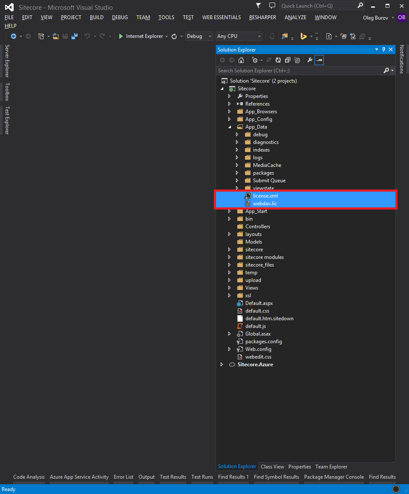

#How to deploy Sitecore 7.5 solution to Microsoft Azure Cloud Service using Visual Studio

After developing a Sitecore solution in Visual Studio, it is possible to manually publish this solution to the Microsoft Azure Cloud Platform.

This article provides a list of techniques that can be used to deploy a Sitecore solution to Microsoft Azure using Microsoft Visual Studio.

> **Important:** It is highly recommended that you get acquainted with the [Compute Hosting Options Provided by Azure](http://azure.microsoft.com/en-us/documentation/articles/fundamentals-application-models/) and [Microsoft Azure Fundamentals](http://www.microsoftvirtualacademy.com/colleges/Azure-fundamentals) before following the instructions in this article.

**Requirements:**
- A work or school account / Microsoft account and a Microsoft Azure subscription with the following Azure services enabled:
  - [Azure Cloud Service](https://msdn.microsoft.com/en-us/library/azure/jj155995.aspx)
  - [Azure Storage](https://msdn.microsoft.com/en-us/library/azure/gg433040.aspx)
  - [Azure SQL Database](https://msdn.microsoft.com/en-us/library/azure/ee336279.aspx)
- Microsoft Visual Studio 2013
- Microsoft Azure SDK 2.6 for .NET
- Microsoft Azure Tool for Visual Studio 2013 
- Microsoft SQL Server Management Studio 2014
- MongoDB 2.6.1
- Sitecore® Experience Platform™ 7.5 rev. 150212 (7.5 Update-2) or higher

> **Note:** To download the latest version of the Microsoft Azure SDK and Tool for Visual Studio, follow this link: http://azure.microsoft.com/en-us/downloads/

##Instructions

The recommended approach to deploy a Sitecore solution to Microsoft Azure using Visual Studio is as follows:

1. In the **Visual Studio**, right-click the **ASP.NET Web Application** project, and then click the **Convert** -> **Convert to Microsoft Cloud Service Project** in the context menu. The **Azure Cloud Service** project is generated.
   
   
   
   > **Note:** For information on creating an ASP.NET Web Application project for Sitecore, see the section [How To Create ASP.NET Web Application Project](how-to-create-aspnet-web-application-project.md).
   
2. In the **Visual Studio**, click the **Tools** -> **NuGet Package Manager** -> **Packages Manager Console**. Run the following command in the **Package Manager Console** window against the **ASP.NET Web Application** project:

    ```
    Update-Package Newtonsoft.Json -Version 6.0.3
    ```
   
3. In the **ASP.NET Web Application** project, include the default Sitecore files, directories and subdirectories: 

   For a **Content Delivery** environment:

   - \App_Browsers
   - \App_Config
   - \App_Data
   - \bin
   - \layouts
   - \sitecore\services
   - \sitecore\shell\Override
   - \sitecore modules
   - \sitecore_files
   - \temp
   - \upload
   - \xsl
   - \Default.aspx
   - \default.css
   - \default.htm.sitedown
   - \default.js
   - \Global.asax
   - \Web.config
   - \webedit.css

   For a **Content Management** environment, additionally include the following directories and files:
   
   - \sitecore\admin
   - \sitecore\Copyright
   - \sitecore\debug
   - \sitecore\images
   - \sitecore\login
   - \sitecore\portal
   - \sitecore\samples
   - \sitecore\service
   - \sitecore\shell
   - \sitecore\blocked.aspx
   - \sitecore\default.aspx
   - \sitecore\no.css

   

   > **Important:** Visual Studio may freeze when including the entire `\sitecore\shell` directory at once because it contains a lot of files and subdirectories. Try to split all the subdirectories into portions, and then add them one by one.

4. For a **Content Management** environment, Visual Studio may throw the following build error: 
 
   ```
   Build: Cannot compile external modules unless the '--module' flag is provided.
   ```
   
   To address the error, in the **ASP.NET Web Application** project's properties, switch to the **TypeScript Build** section and set the **AMD** as the **Module system**. Otherwise, exclude the following files from the project:
   - \sitecore\shell\client\Speak\Assets\lib\core\1.2\SitecoreSpeak.ts
   - \sitecore\shell\client\Speak\Assets\lib\core\1.2\SitecoreSpeak.d.ts  
       
5. In the **Visual Studio**, click the **Tools** -> **NuGet Package Manager** -> **Packages Manager Console**. Run the following command in the **Package Manager Console** window against the **ASP.NET Web Application** project:     
  
    ```
    Install-Package Sitecore.Azure.Setup -Version 7.5.0
    ```
   
   > **Important:** Modify both the `Web.Debug.config` and `Web.Release.config` files under the `\configuration\connectionStrings` element.
   > - For SQL Server connection strings, replace the `{server-name}` with the name of your Azure SQL Database service. The `{server-admin-login}` and `{password}` with SQL Server account credentials. 
   > - For MongoDB connection strings, replace the `{host}` with the URL of your Mongo service. The `{user-name}` and `{password}` with your Mongo account credentials.
    
   > **Note:** For information on deploying Sitecore databases to Azure, see the section [How to deploy Sitecore databases to Azure SQL Database](how-to-deploy-sitecore-databases-to-azure-sql-database.md).
    
6. In the **ASP.NET Web Application** project, include the `Startup.cmd` file in the the `\bin` folder.

   

7. In the **Azure Cloud Service** project, modify the `ServiceDefinition.csdef` file under the `WebRole` element. Add the following task definition to execute the `Startup.cmd` file:

    ```xml
    <ServiceDefinition>
      <WebRole>
      ...
        <Startup>
          <Task commandLine="Startup.cmd" executionContext="elevated" taskType="simple" />
        </Startup>
      ...
      </WebRole>
    </ServiceDefinition>
    ```

8. In the **ASP.NET Web Application** project, right-click the `App_Data` item. Add the `license.xml` and `webdav.lic` files using the **Add** -> **Existing Item...** command in the context menu.

   

9. In the **Visual Studio**, click **Tools** -> **NuGet Package Manager** -> **Packages Manager Console**. Run the following command in the **Package Manager Console** window against the **ASP.NET Web Application** project:

   ```xml
   Install-Package Sitecore.Azure.Diagnostics -Version 7.5.0
   ```

   > **Note:** Modify both the `Web.Debug.config` and `Web.Release.config` files under the `\configuration\appSettings` element. Replace the `{account-name}` with the name of your storage account, and the `{account-key}` with your account access key.  

10. In the **ASP.NET Web Application** project, right-click the `Web.Debug.config` and then `Web.Release.config` files. Use the **Preview Transform** command in the context menu to check that all transformations look correct as you expect them to be.

   

   > **Note:** For more details about Web.config transformation syntax for Web Project Deployment using Visual Studio, see the MSDN website: http://msdn.microsoft.com/en-us/library/dd465326.aspx

11. Right-click on the **Azure Cloud Service** project, and click the **Set as StartUp Project** in the context menu. Use Azure Computer Emulator to run and debug Sitecore instance locally.

   

   > **Note:** For information regarding using Emulator Express to Run and Debug a Cloud Service Locally, see the MSDN website: https://msdn.microsoft.com/library/azure/dn339018.aspx
   
12. Right-click the **Azure Cloud Service** project, and then click the **Publish...**  in the context menu. The **Publishing Azure Application** dialog box appears.     

   

13. In the **Publishing Azure Application** dialog box, publish the **Sitecore** solution to the **Microsoft Azure Cloud Platform**. 

   

   > **Note:** For the basic information about the Publish Azure Application Wizard, see the MSDN website: http://msdn.microsoft.com/en-us/library/azure/hh535756.aspx