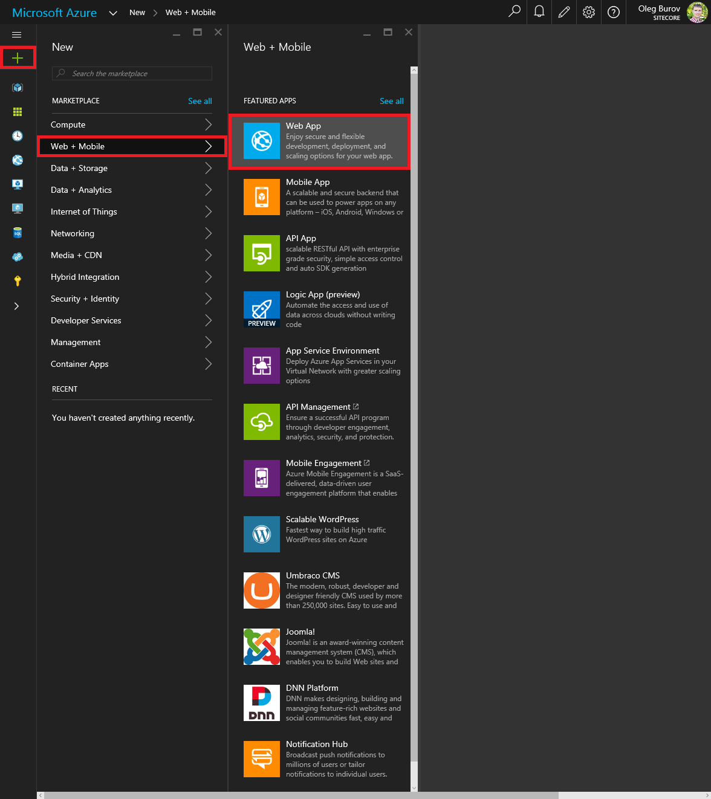
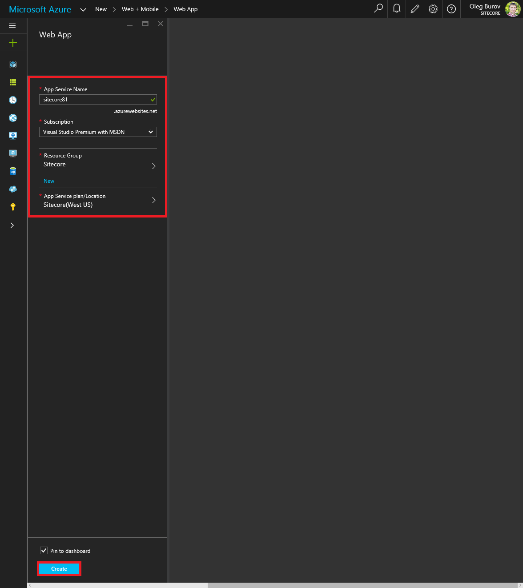
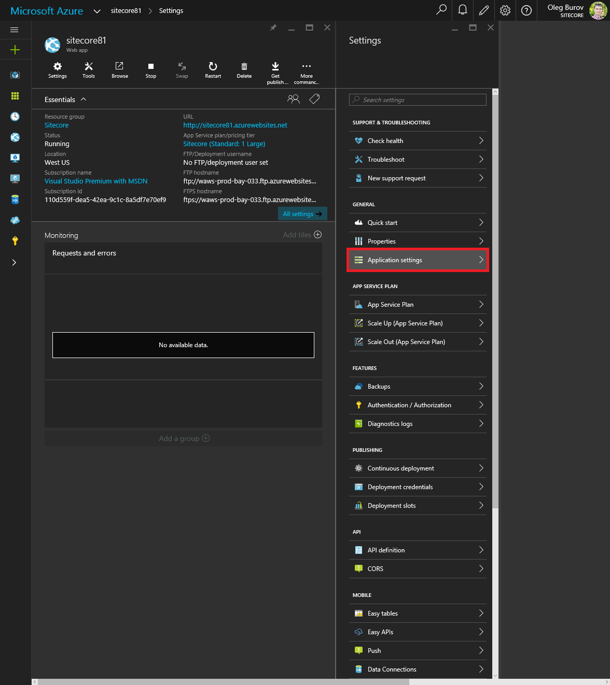
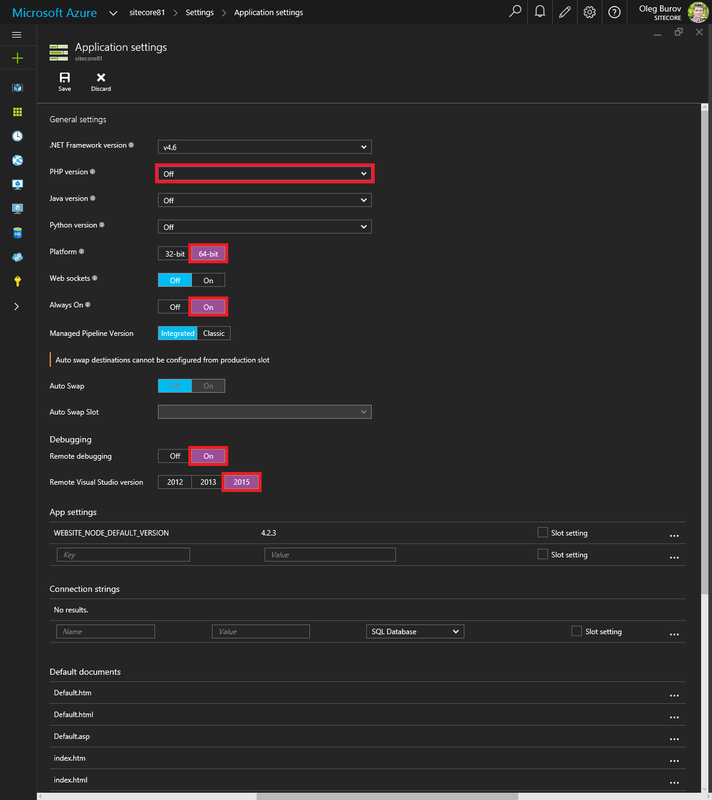
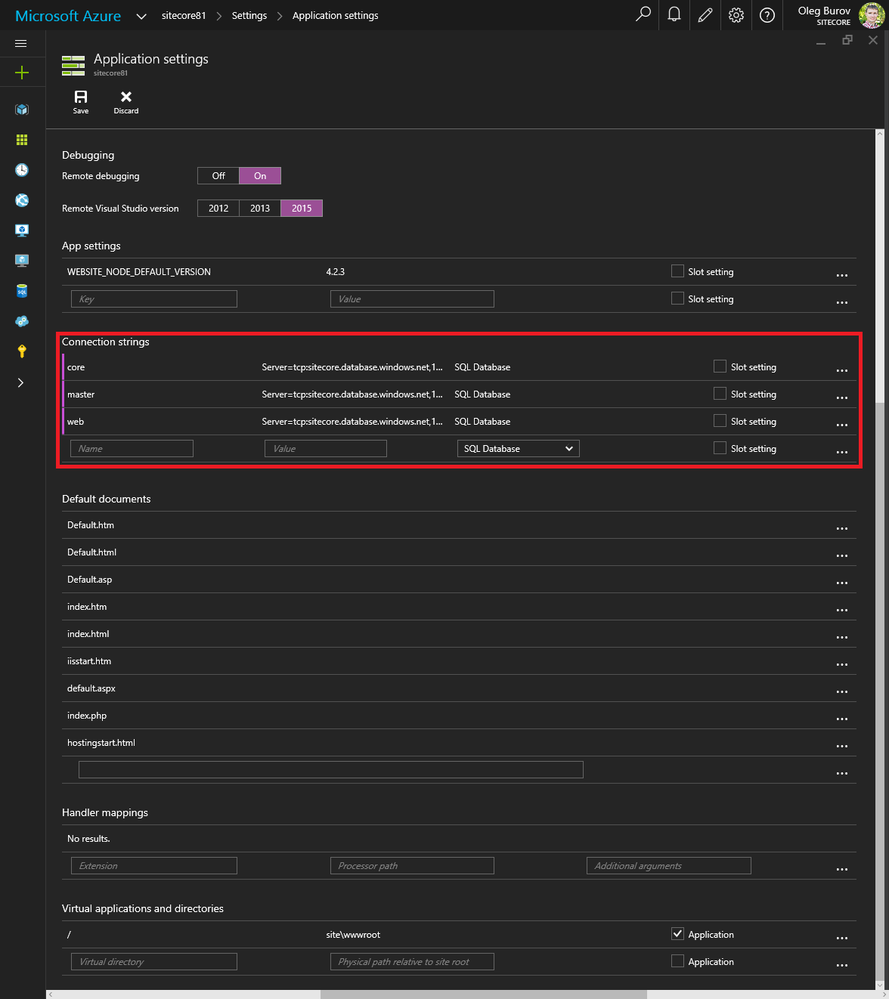
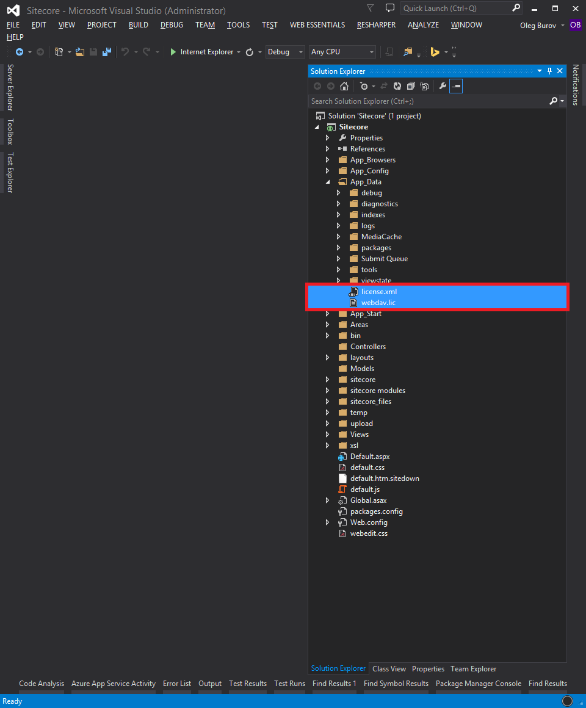
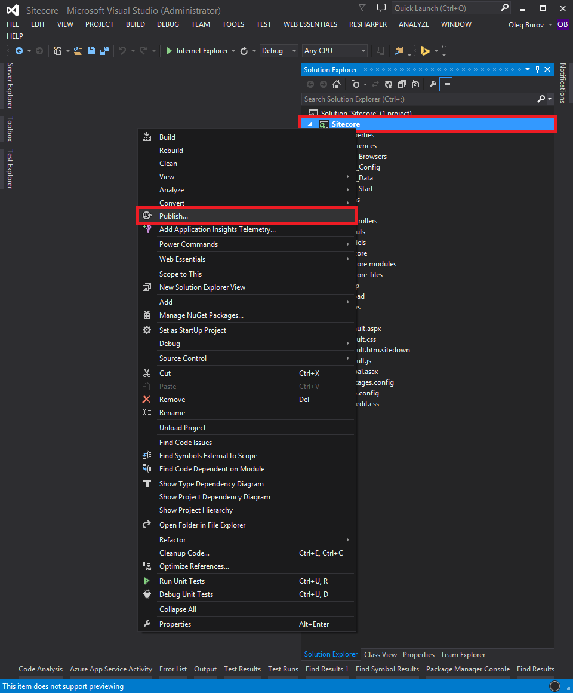

#How to deploy Sitecore 8.1 solution to Microsoft Azure Web App using Visual Studio

> **NB:** On Azure Web Apps, Sitecore does not support scaling out App Service Plan due to shared `WWWROOT` directory between instances. Sitecore application has certain types of data that requires persistence in the file system.

After developing a Sitecore solution in Visual Studio, it is possible to manually publish this solution to the Microsoft Azure Cloud Platform.

This article provides a list of techniques that can be used to deploy a Sitecore solution to Microsoft Azure using Microsoft Visual Studio.

> **Important:** It is highly recommended that you get acquainted with the [Compute Hosting Options Provided by Azure](http://azure.microsoft.com/en-us/documentation/articles/fundamentals-application-models/) and [Microsoft Azure Fundamentals](http://www.microsoftvirtualacademy.com/colleges/Azure-fundamentals) before following the instructions in this article.

**Requirements:**
- A work or school account / Microsoft account and a Microsoft Azure subscription with the following Azure services enabled:
  - [Azure Web App](https://msdn.microsoft.com/en-us/library/azure/dn948515.aspx)
  - [Azure Storage](https://msdn.microsoft.com/en-us/library/azure/gg433040.aspx)
  - [Azure SQL Database](https://msdn.microsoft.com/en-us/library/azure/ee336279.aspx)
- Microsoft Visual Studio 2015
- Microsoft Azure SDK 2.8.2 for .NET or newer 
- Microsoft SQL Server Management Studio 2014 or newer
- Sitecore® Experience Platform™ 8.1 rev. 151207 (8.1 Update-1) or higher

> **Note:** To download the latest version of the Microsoft Azure SDK and Tool for Visual Studio, follow this link: http://azure.microsoft.com/en-us/downloads/

##Instructions

The recommended approach to deploy a Sitecore solution to Microsoft Azure using Visual Studio is as follows:

1. Log in to the **Microsoft Azure Portal** using the https://portal.azure.com URL.
  
   
  
2. In the **Jumpbar**, click the **New** button, then select the **Web + Mobile** section and click the **Web App** button. The **Web App** blade appears.
   
   
   
3. In the **Web App** blade, fill in the **URL** field and configure the other section if needed, then click the **Create** button. 
 
   
 
4. In the **Startboard**, click on the **Web App** tile.

   

5. In the **Web App** blade, click the **All settings** button and select the **Application settings** section.
 
   
 
6. In the **Application settings** blade, configure the following groups and save the changes.
 
   - In the **General settings** group:
     + Set the **PHP version** switcher to the **Off** value. 
     + Make sure the **Platform** switcher is set to **64-bit** value.
     + Make sure the **Always On** switcher is set to the **On** value.
     + \[Optional\] Set the **Remote debugging** switcher to the **On** value and select the Visual Studio version.
   
   
   
   - In the **Connection strings** group:
     + Add the `core`, `master` and `web` SQL Database connection strings. 

   
  
   > **Note:** For information on deploying Sitecore databases to Azure, see the section [How to deploy Sitecore databases to Azure SQL Database](how-to-deploy-sitecore-databases-to-azure-sql-database.md).
      
   ```xml
   Server=tcp:{server-name}.database.windows.net,1433;Database=Sitecore.Core;User ID={server-admin-login}@{server-name};Password={password};Trusted_Connection=False;Encrypt=True
   Server=tcp:{server-name}.database.windows.net,1433;Database=Sitecore.Master;User ID={server-admin-login}@{server-name};Password={password};Trusted_Connection=False;Encrypt=True
   Server=tcp:{server-name}.database.windows.net,1433;Database=Sitecore.Web;User ID={server-admin-login}@{server-name};Password={password};Trusted_Connection=False;Encrypt=True   
   ```
   
   > **Note:** Use the above templates as an example of default Sitecore connection strings. Replace the `{server-name}` with the name of your Azure SQL Database server. The `{server-admin-login}` and `{password}` with SQL Server account credentials.
   
7. In the **ASP.NET Web Application** project, include the default Sitecore files, directories and subdirectories. 

   > **Note:** For information on creating an ASP.NET Web Application project for Sitecore, see the section [How To Create ASP.NET Web Application Project](how-to-create-aspnet-web-application-project.md).

   - For a **Content Delivery** environment:
   
     + \App_Browsers
     + \App_Config
     + \App_Data
     + \Areas
     + \bin
     + \Controllers
     + \layouts
     + \Models
     + \sitecore\services
     + \sitecore modules
     + \sitecore_files
     + \temp
     + \upload
     + \Views
     + \xsl
     + \Default.aspx
     + \default.css
     + \default.htm.sitedown
     + \default.js
     + \Global.asax
     + \Web.config
     + \webedit.css

   - For a **Content Management** environment, additionally include the following directories and files:
   
     + \sitecore\admin
     + \sitecore\Copyright
     + \sitecore\debug
     + \sitecore\images
     + \sitecore\login
     + \sitecore\portal
     + \sitecore\samples
     + \sitecore\service
     + \sitecore\shell
     + \sitecore\blocked.aspx
     + \sitecore\default.aspx
     + \sitecore\no.css

   

   > **Important:** Visual Studio may freeze when including the entire `\sitecore\shell` directory at once because it contains a lot of files and subdirectories. Try to split all the subdirectories into portions, and then add them one by one.

8. For a **Content Management** environment, Visual Studio may throw the following build errors:   
       
   ```
   Build: Cannot compile external modules unless the '--module' flag is provided.
   ```   
    
   To address the above error, make sure that you have [TypeScript for Microsoft Visual Studio](http://www.typescriptlang.org/) extension installed. In the **ASP.NET Web Application** project's properties, switch to the **TypeScript Build** section and set the **Module system** property to the **AMD** value. Otherwise, exclude the following files from the project:
   - \sitecore\shell\client\Speak\Assets\lib\core\2.0\SitecoreSpeak.ts
   - \sitecore\shell\client\Speak\Assets\lib\core\2.0\SitecoreSpeak.d.ts
    
    
    
   ```
   Project file must include the .NET Framework assembly 'WindowsBase, PresentationCore, PresentationFramework' in the reference list.    
   ```
    
   To address the above error, in the **Solution Explorer** window, set the **Build Action** property to the **Content** value for the following item:
   - \sitecore\shell\ClientBin\EmptySplashScreen.xaml 
    
9. In the **Visual Studio**, click the **Tools** -> **NuGet Package Manager** -> **Packages Manager Console**. Run the following command in the **Package Manager Console** window against the **ASP.NET Web Application** project:     
  
   ```PowerShell
   Install-Package Sitecore.Azure.Setup -Version 8.1.0
   ```
   
10. In the **ASP.NET Web Application** project, right-click the `App_Data` item. Add the `license.xml` and `webdav.lic` files using the **Add** -> **Existing Item...** command in the context menu.

   
 
11. Right-click the **ASP.NET Web Application** project, and then click the **Publish...**  in the context menu. The **Publish Web** dialog box appears.     

   

12. In the **Publish Web** dialog box, click the **Microsoft Azure Web App Service** option and select the Web App that was created on previous steps. 

   

   > **Note:** For the basic information about the Publish Web Wizard, see the MSDN website: https://msdn.microsoft.com/en-us/library/dd465337(v=vs.110).aspx 
