#How to deploy Sitecore databases to Azure SQL Database

This article provides a list of techniques that can be used to deploy Sitecore databases to Microsoft Azure using Microsoft SQL Server Management Studio.

**Requirements:**
- A work or school account / Microsoft account and a Microsoft Azure subscription with the following Azure services enabled:
  - [Azure Storage](https://msdn.microsoft.com/en-us/library/azure/gg433040.aspx)
  - [Azure SQL Database](https://msdn.microsoft.com/en-us/library/azure/ee336279.aspx)
- Microsoft SQL Server Management Studio 2014 Service Pack 1 or higher
- Sitecore CMS and DMS 7.2 or Sitecore® Experience Platform™ 7.5 or higher

> **Note:** See also [How to deploy Sitecore databases to Azure SQL Database using PowerShell](https://github.com/olegburov/Sitecore-Azure-Content/blob/master/articles/how-to-deploy-sitecore-databases-to-azure-sql-database-using-powershell.md).

##Instructions

The recommended approach to deploy Sitecore databases to the [Microsoft Azure SQL Database](https://msdn.microsoft.com/en-us/library/azure/ee336279.aspx) service is as follows:

1. Log in to the **Microsoft Azure Portal** using the https://portal.azure.com URL.

   

2. In the **Jumpbar**, click the **New** button, then select the **Data + Storage** section and click the **Storage** button. The **Storage account** blade appears.

   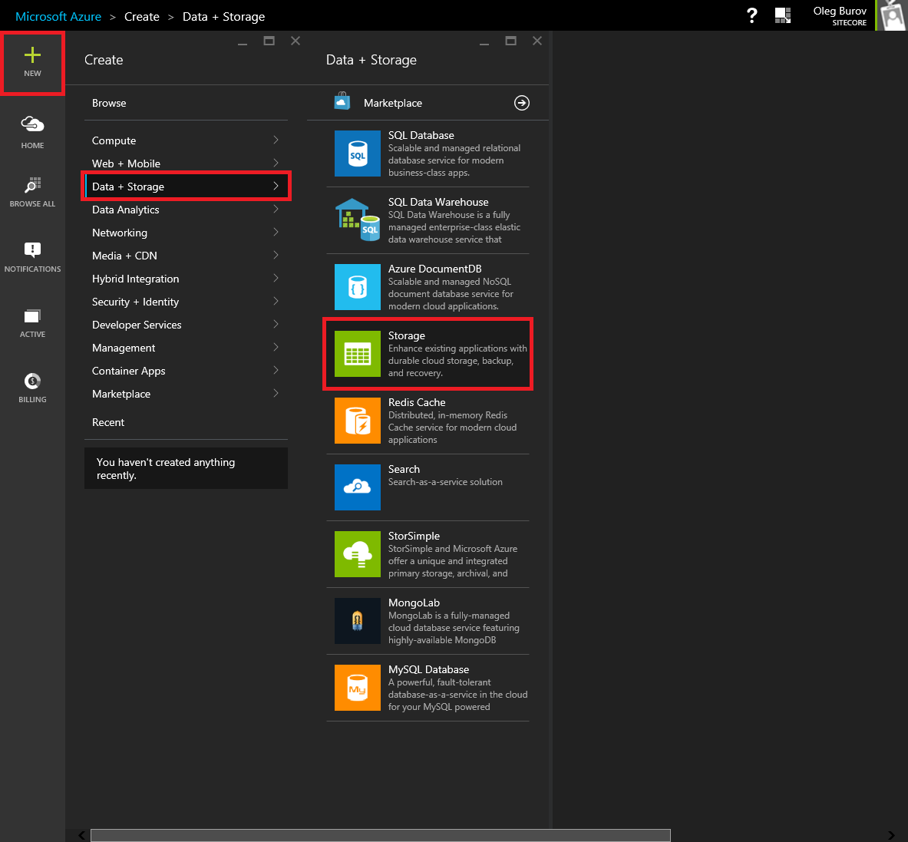

3. In the **Storage account** blade, fill in the **Storage** field and configure the other section if needed, then click the **Create** button. 

   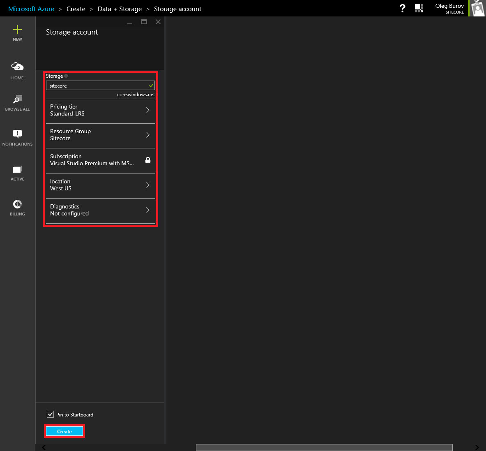

4. In the **Startboard**, click on the **Storage** tile.

   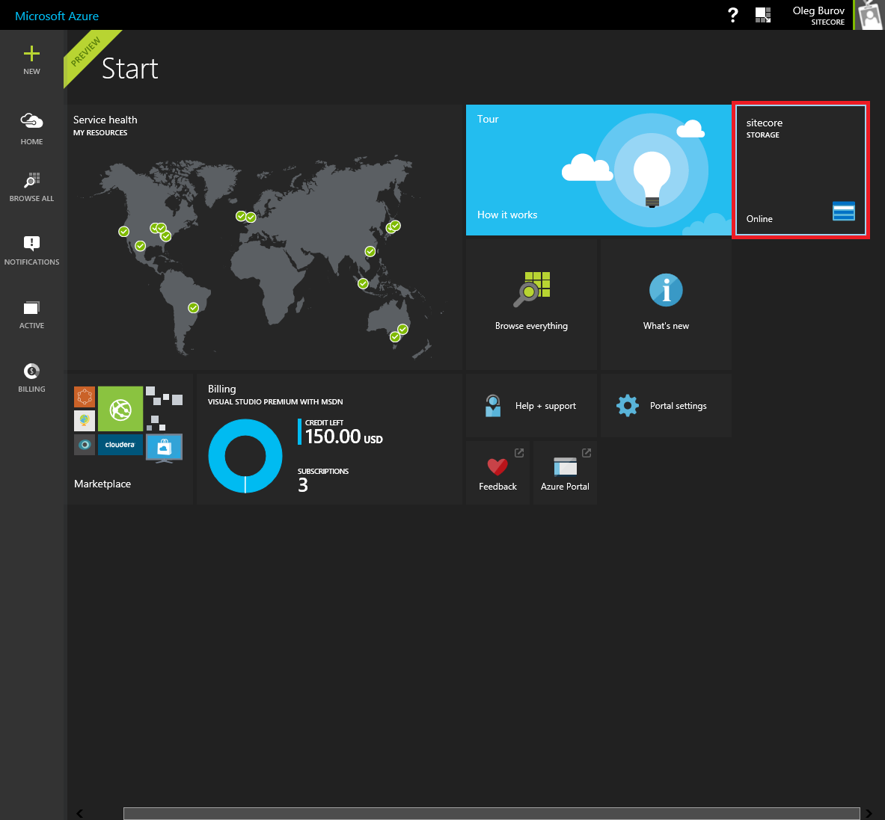

5. In the **Storage account** blade, click the **All settings** button and select the **Keys** section. The **Manage keys** blade appears.

   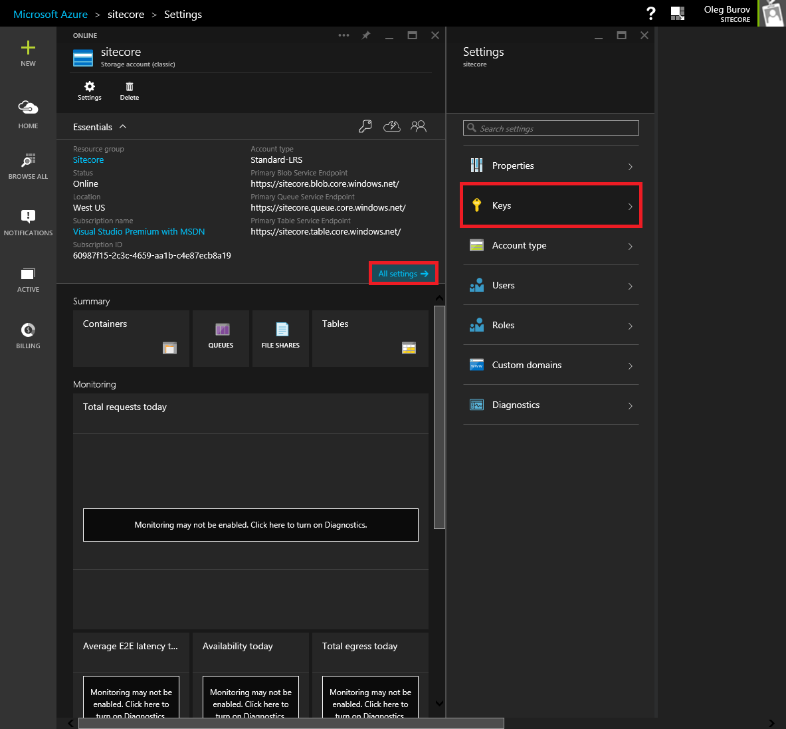

6. In the **Manage keys** blade, copy the **Storage account name** and **Primary access key**.

   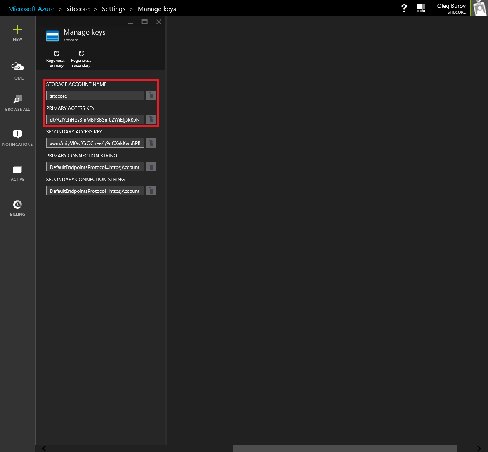

7. In the **SQL Server Management Studio**, update the Sitecore database schema to fit the **Azure SQL Database** service requirements:
   - For Sitecore CMS 7.2 - execute the [SQL Azure \[Core, Master, Web\].sql](./media/how-to-deploy-sitecore-databases-to-azure-sql-database/SQL Azure [Core, Master, Web].sql) script on the Sitecore Core, Master and Web databases.
   - For Sitecore DMS 7.2 - execute the [SQL Azure \[Analytics\].sql](./media/how-to-deploy-sitecore-databases-to-azure-sql-database/SQL Azure [Analytics].sql) script on the Sitecore Analytics databases.
   - For Sitecore XP 7.5 or 8.X - execute the [SQL Azure [Session].sql](./media/how-to-deploy-sitecore-databases-to-azure-sql-database/SQL Azure [Session].sql) script on the Sitecore Session database.   
   
8. In the **SQL Server Management Studio**, in the **Object Explorer** window, right-click a Sitecore database, and select **Tasks -> Export Data-tier Application...** in the context menu. The **Export data-tier Application** dialog box appears. 

   

9. In the **Export data-tier Application** dialog box, click the **Next >** button to go to the **Export Settings** step. 

   

10. In the **Export Settings** step, select the **Save to Windows Azure** option and click the **Connect...** button. The **Connect to Windows Azure Storage** dialog box appears.

   

11. In **Connect to Windows Azure Storage** dialog box, fill in the **Storage account** and **Access key** fields using the copied Storage account name and Primary access key from the **Microsoft Azure Portal**, then click the **Connect** button.

   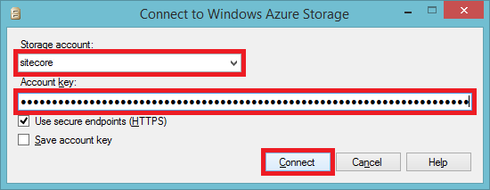

12. In the **Export Settings** step, fill in the **Container** field and then click the **Next >** button to go to the **Summary** step. 

   

13. In the **Summary** step, click the **Finish** button to start creating a `*.bacpac` file. 

   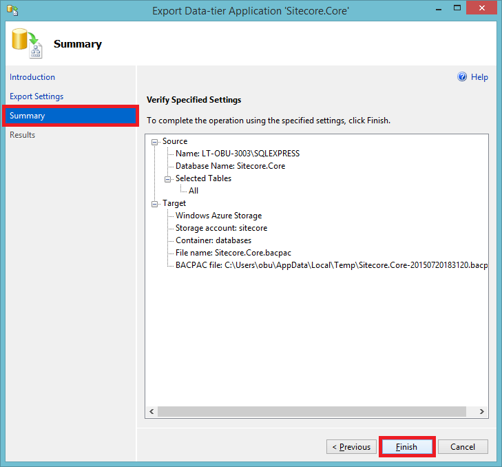

14. In the **Results** step, click the **Close** button when the operation is complete. 

   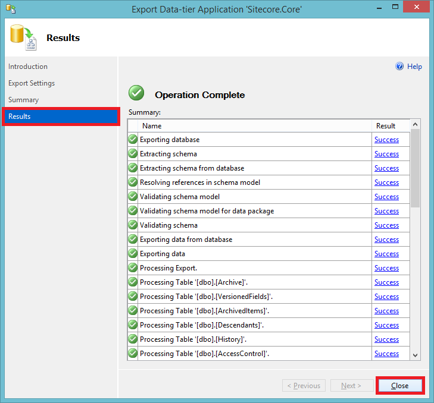

16. Repeat steps 8-14 for each Sitecore database you want to export.

17. In the **Microsoft Azure Portal**, in the **Jumpbar**, click the **New** button, then select the **Data + Storage** section and click the **SQL Database** button. The **SQL Database** blade appears. 

   

18. In the **SQL Database** blade, click on the **Server** section. Then create a new server configuration. 

  
  
  > **Note:** Sitecore recommends using [Azure SQL Database server V12](http://azure.microsoft.com/en-us/documentation/articles/sql-database-v12-whats-new/) to get the better experience. You must use SQL Server Management Studio 2014 Service Pack 1 or higher, which brings support for Azure SQL Database V12. 

19. In the **SQL Database** blade, fill in the **Name** field and configure the other section if needed, then click the **Create** button.

  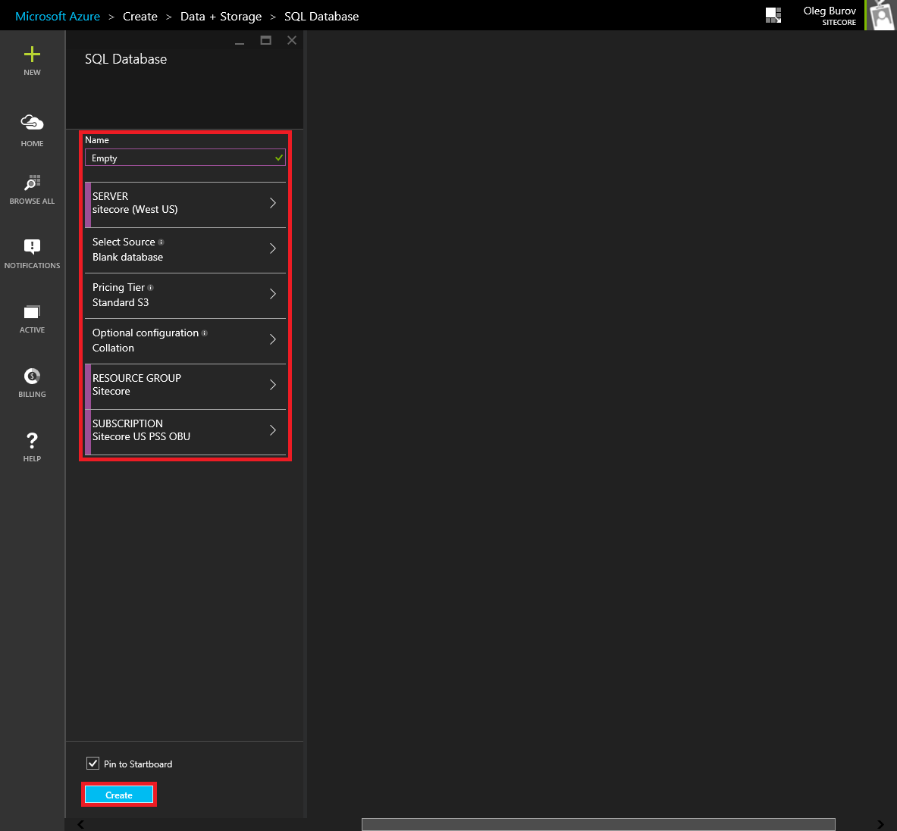

20. In the **Startboard**, click on the **SQL Database** tile.

  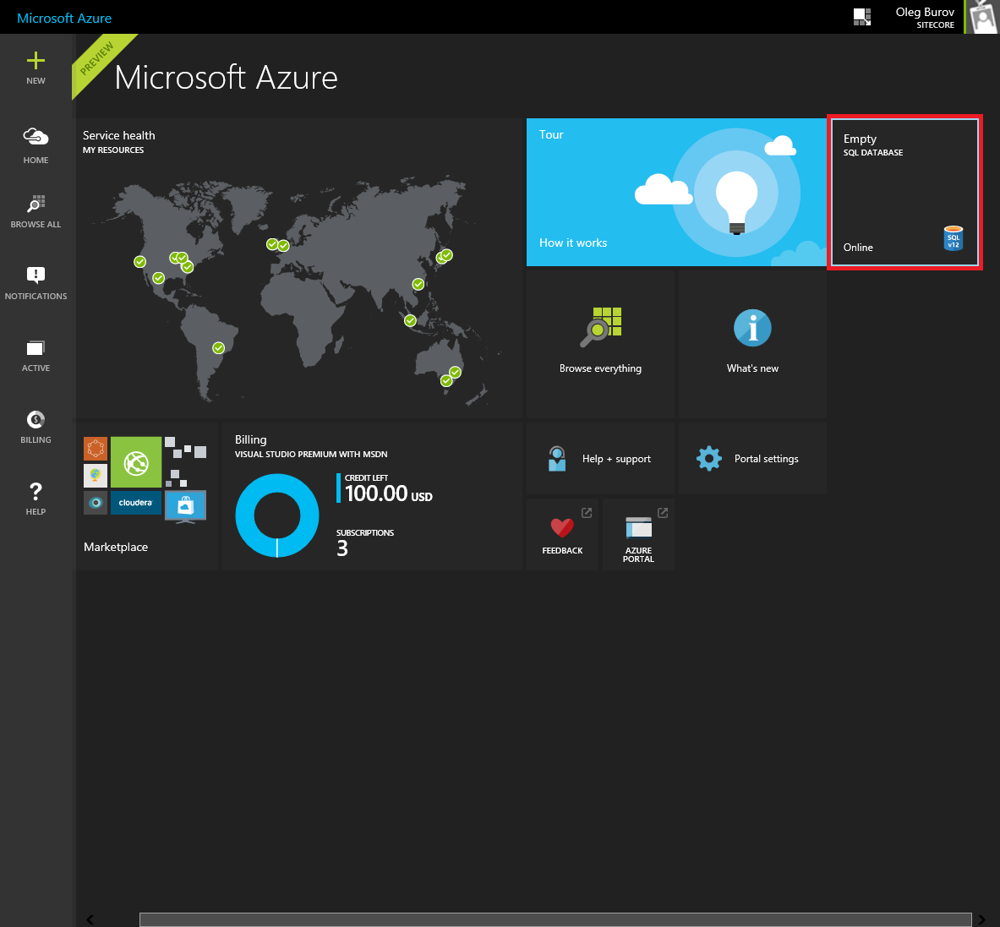

21. In the **SQL Database** blade, click the **Delete** button in the top menu.

  
  
  > **Note:** The `Empty` SQL Database is created with a SQL Server instance. However, it is not needed. 

22. In the **Jumpbar**, click the **Browser All** button and select the **SQL servers** from the list. The **SQL servers** blade appears.

  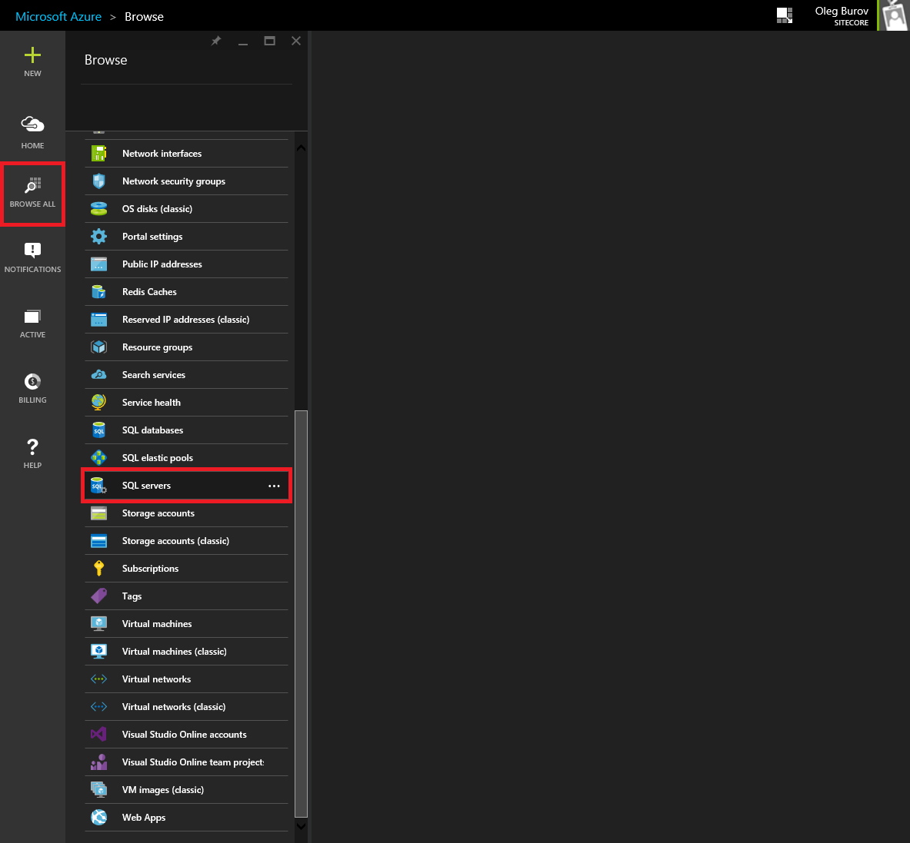

23. In the **SQL servers** blade, click on the SQL Server instance you created before. The **SQL Server** blade appears.

  

24. In the **SQL Server** blade, click the **Import database** button in the top menu. The **Import Database** blade appears.

  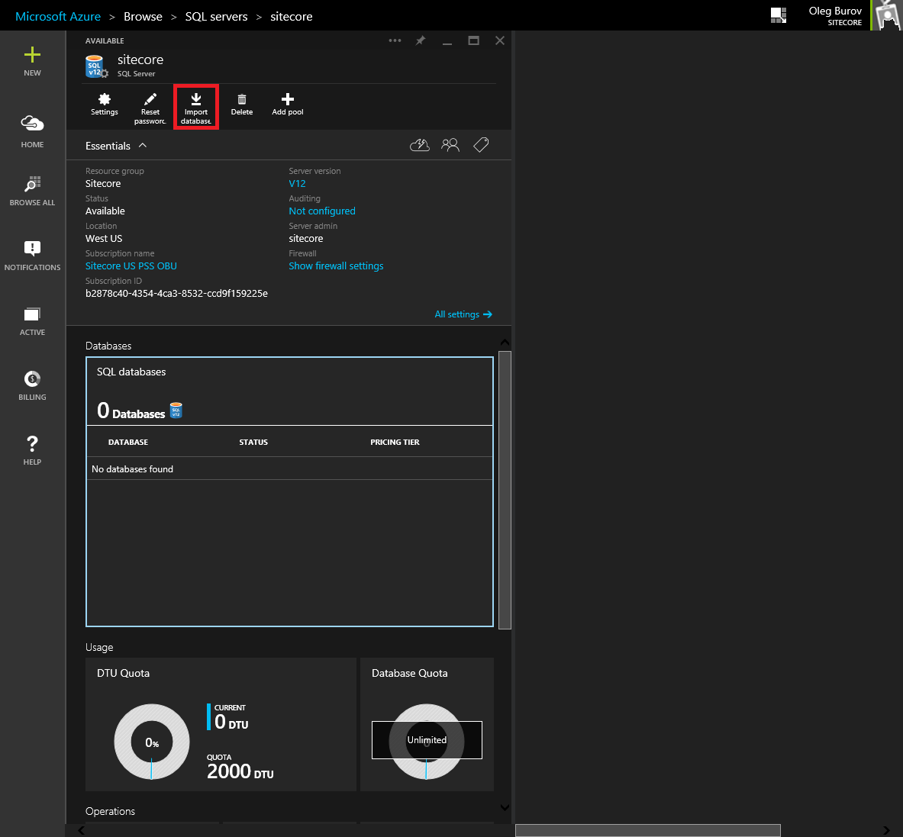

25. In the **Import Database** blade, select the created storage account and container with `*.bacpac` file, then click the **OK** button.

  

26. In the **Import Database** blade, configure the **Pricing Tier** section and fill in the **Database Name**, **Server Admin Login** and **Password** fields, then click the **Create** button.

  

27. Repeat steps 24-26 for each Sitecore database you want to import.

##Download Options

Exported Sitecore databases as `*.bacpac` files:

- Sitecore CMS and DMS 7.2:
  + [Sitecore72.Core.bacpac](./media/how-to-deploy-sitecore-databases-to-azure-sql-database/Sitecore72.Core.bacpac)
  + [Sitecore72.Master.bacpac](./media/how-to-deploy-sitecore-databases-to-azure-sql-database/Sitecore72.Master.bacpac)
  + [Sitecore72.Web.bacpac](./media/how-to-deploy-sitecore-databases-to-azure-sql-database/Sitecore72.Web.bacpac)
  + [Sitecore72.Analytics.bacpac](./media/how-to-deploy-sitecore-databases-to-azure-sql-database/Sitecore72.Analytics.bacpac)

- Sitecore XP 7.5:
  + [Sitecore75.Core.bacpac](./media/how-to-deploy-sitecore-databases-to-azure-sql-database/Sitecore75.Core.bacpac)
  + [Sitecore75.Master.bacpac](./media/how-to-deploy-sitecore-databases-to-azure-sql-database/Sitecore75.Master.bacpac)
  + [Sitecore75.Web.bacpac](./media/how-to-deploy-sitecore-databases-to-azure-sql-database/Sitecore75.Web.bacpac)
  + [Sitecore75.Reporting.bacpac](./media/how-to-deploy-sitecore-databases-to-azure-sql-database/Sitecore75.Reporting.bacpac)
  + [Sitecore75.Session.bacpac](./media/how-to-deploy-sitecore-databases-to-azure-sql-database/Sitecore75.Session.bacpac)

- Sitecore XP 8.0:
  + [Sitecore80.Core.bacpac](./media/how-to-deploy-sitecore-databases-to-azure-sql-database/Sitecore80.Core.bacpac)
  + [Sitecore80.Master.bacpac](./media/how-to-deploy-sitecore-databases-to-azure-sql-database/Sitecore80.Master.bacpac)
  + [Sitecore80.Web.bacpac](./media/how-to-deploy-sitecore-databases-to-azure-sql-database/Sitecore80.Web.bacpac)
  + [Sitecore80.Reporting.bacpac](./media/how-to-deploy-sitecore-databases-to-azure-sql-database/Sitecore80.Reporting.bacpac)
  + [Sitecore80.Session.bacpac](./media/how-to-deploy-sitecore-databases-to-azure-sql-database/Sitecore80.Session.bacpac)
  
- Sitecore XP 8.1 Update-1:
  + [Sitecore81.Core.bacpac](./media/how-to-deploy-sitecore-databases-to-azure-sql-database/Sitecore81.Core.bacpac)
  + [Sitecore81.Master.bacpac](./media/how-to-deploy-sitecore-databases-to-azure-sql-database/Sitecore81.Master.bacpac)
  + [Sitecore81.Web.bacpac](./media/how-to-deploy-sitecore-databases-to-azure-sql-database/Sitecore81.Web.bacpac)
  + [Sitecore81.Reporting.bacpac](./media/how-to-deploy-sitecore-databases-to-azure-sql-database/Sitecore81.Reporting.bacpac)
  + [Sitecore81.Session.bacpac](./media/how-to-deploy-sitecore-databases-to-azure-sql-database/Sitecore81.Session.bacpac)