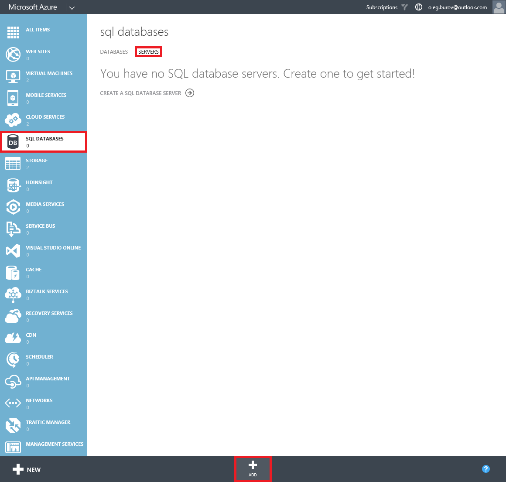
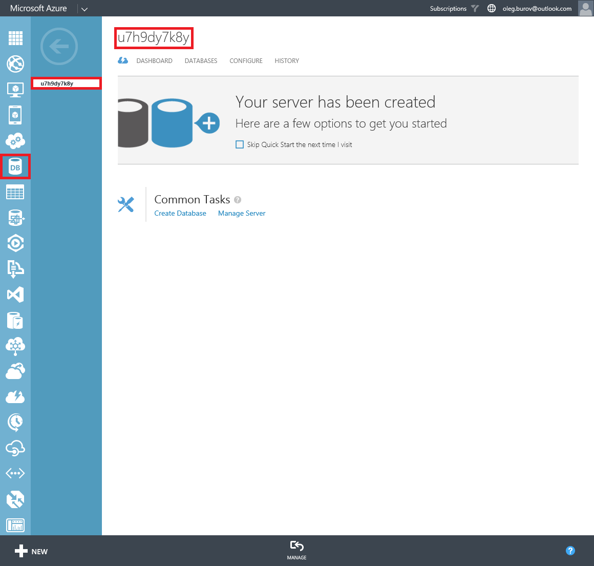
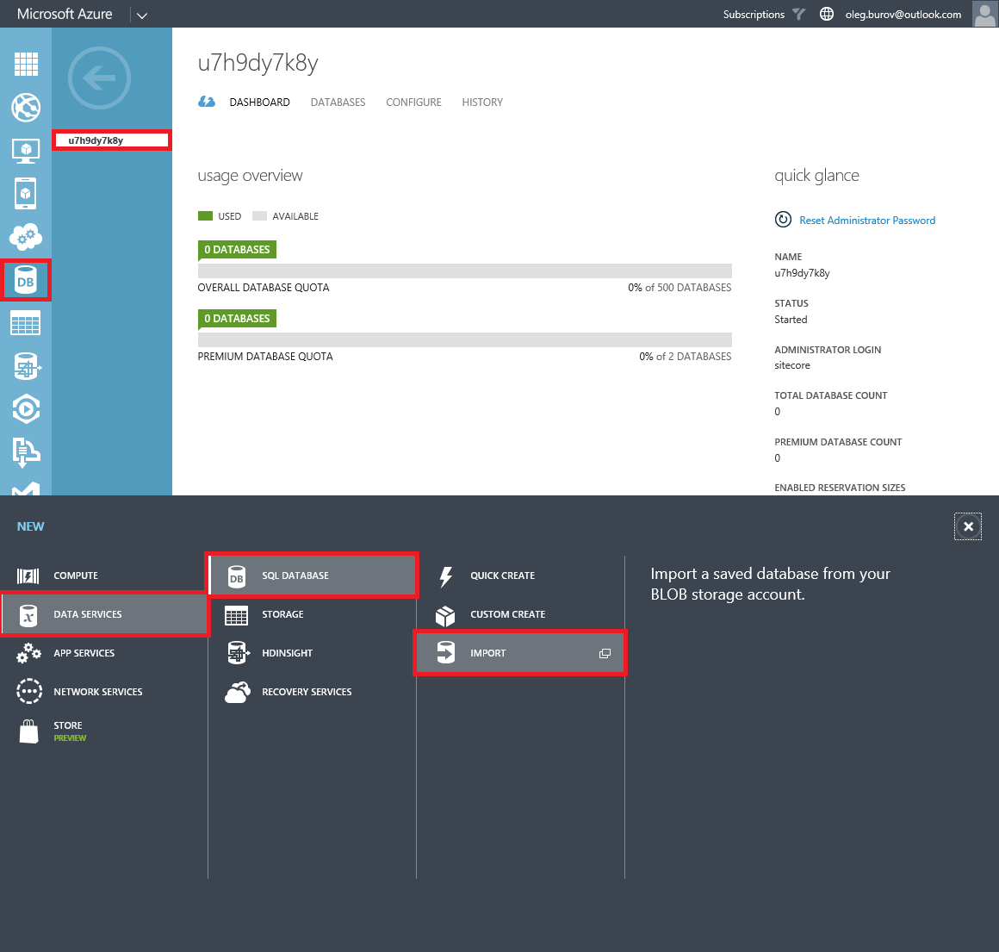
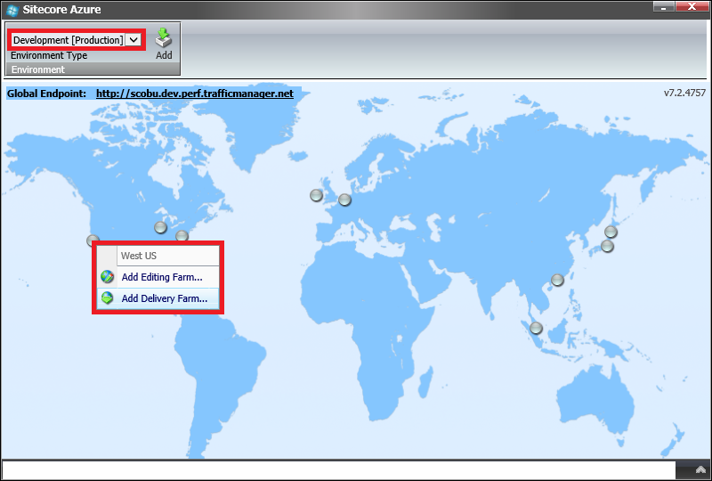
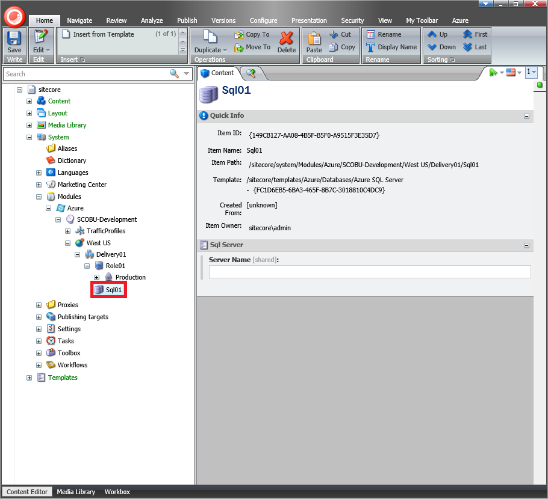
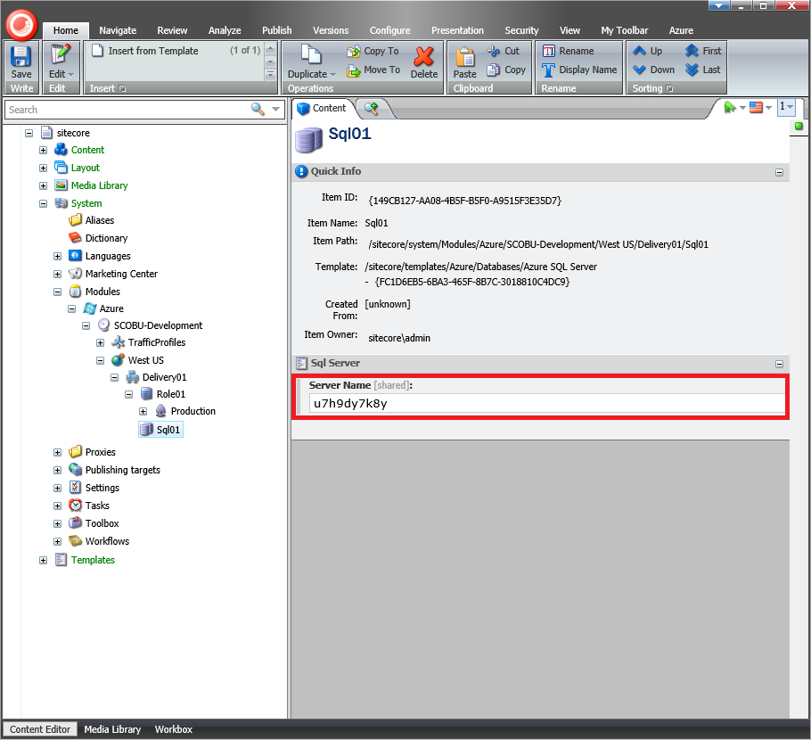
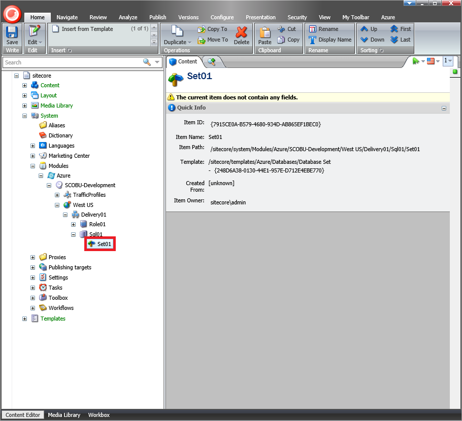
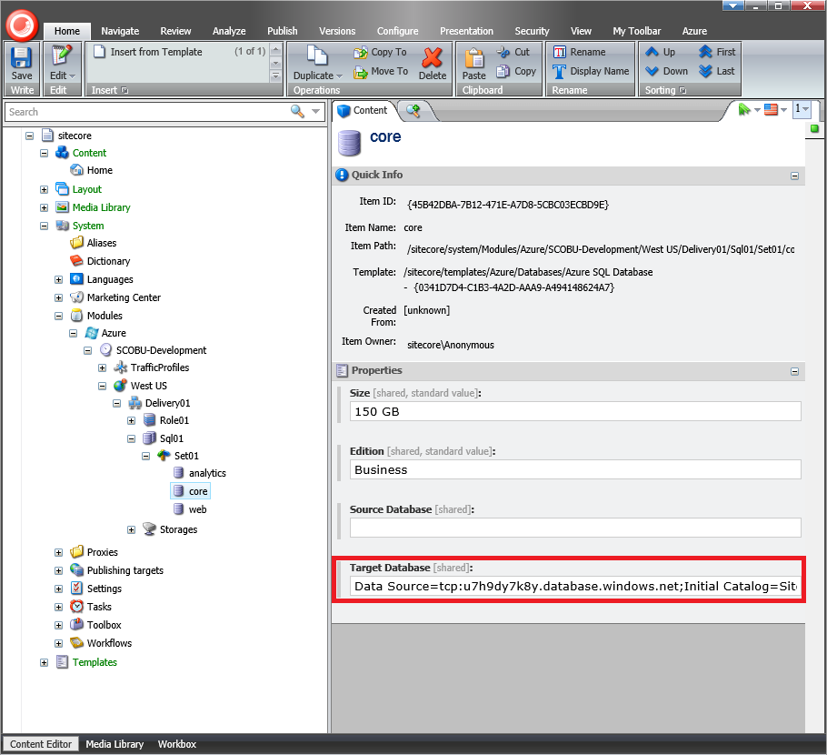
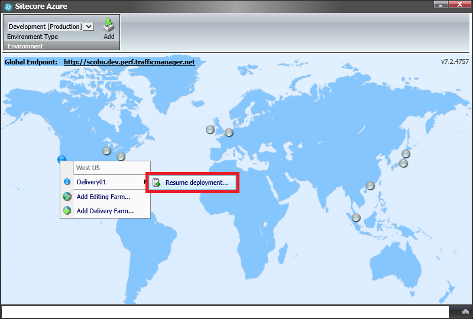

# How to use a custom Azure SQL Databases Service in Sitecore Azure

The Sitecore Azure module automatically creates all Microsoft Azure services it uses during deployment, as well as generates names for them. The pattern for generating names depends on the project name and environment type from the Sitecore Azure Environment file, as well as the deployment location, deployment type, etc.

One of the services used during deployment is the [Microsoft Azure SQL Databases Service](https://msdn.microsoft.com/en-us/library/azure/ee336279.aspx). Microsoft Azure requires that the name of the Microsoft Azure SQL Server instance be unique, since it is used as a part of the public URL prefix for the `*.database.windows.net` host name.

This article provides a list of techniques that can be used to manually create the Microsoft Azure SQL Databases Service and deploy a Sitecore solution using this SQL Databases Service when using the Sitecore Azure module.

## Solution

The recommended approach to use a custom Azure SQL Databases Service in Sitecore Azure is as follows:

1. Log in to the **Microsoft Azure Management Portal** using the https://manage.windowsazure.com URL.

2. In the **SQL Databases** section, switch to the **Servers** tab and click the **Add** button.

   

3. In the **Create Server** dialog, fill in the **Login Name**, **Password** fields and select a region for the SQL database server instance.

   

4. Select the created server instance and copy its name.

   

5. Switch to the **Configure** tab, add the client IP address to the allowed IP addresses list and save changes.

   

6. Switch to the **Databases** tab and import Sitecore databases (Data Services -> SQL Database -> Quick Create or Import).

   

   > **Note:** export the schema and data from Sitecore databases to `*.bacpac` files using the MS SQL Server Management Studio (right click on a database -> Tasks -> Export Data-tier Application...).
   
7. Log in to the **Sitecore Client** and open the **Sitecore Azure** application.

8. Select either the **Staging** or **Production** slot and click on a data center to add an **Editing** or **Delivery Farm**.

   

9. In the **New Deployment** dialog, click the **More Options** button. The **Content Editor** with a preselected `Azure Deployment` item appears.   

   

10. Select the `/sitecore/system/Modules/Azure/<Environment>/<Location>/<Farm>/Sql01` item.

   
   
11. In the `Sql01` item, insert the copied **Azure SQL Server** instance name into the **Server Name** field.

   
   
12. Insert a new item based on the `/sitecore/templates/Azure/Databases/Database Set` template, using `Set01` as the item name.

   
   
13. Select the `Set01` item and insert new `core`, `web` and `analytics` items based on the `/sitecore/templates/Azure/Databases/Azure SQL Database` template.

   
   
   > **Note:** the analytics item must be inserted only if Sitecore DMS is enabled in the Sitecore solution.
   
14. In the `core`, `web` and `analytics` items, fill in the **Target Database** field using a connection string to the imported Sitecore databases in the Azure SQL Databases server.

   
   
   > **Note:** the connection string to the Sitecore Core database in the Azure SQL Databases service would be as follows:
   
   ```xml
   Data Source=tcp:u7h9dy7k8y.database.windows.net;Initial Catalog=Sitecore_Core;Integrated Security=False;User ID=sitecore@u7h9dy7k8y;Password={your_password_here};Encrypt=True
   ```

15. In the `core`, `master`, `web` and `analytics` items, fill in the **Database Id** field using the corresponding items under the `/sitecore/system/Modules/Azure/<Environment>/<Location>/<Farm>/Sql01/Set01` item.

   
   
16. Recycle the Sitecore Application Pool or reset Internet Information Services (IIS).

17. Open the **Sitecore Azure** application and resume the deployment.

   
   
18. In the **New Deployment** dialog, click the **Start Deployment** button.

   
