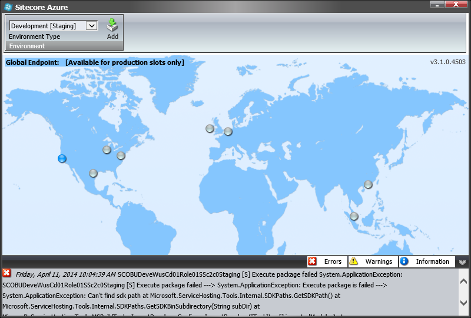

#Microsoft Azure SDK Compatibility Table

If a wrong version of [Microsoft Azure SDK for .NET](http://azure.microsoft.com/en-us/downloads/archive-net-downloads/) is installed, the following error will be shown while deploying a Sitecore solution using the Sitecore Azure module. This happens even if the installed Microsoft Azure SDK version is newer than the one that the Sitecore Azure module requires.



An example of the exception and its stack trace is:

```
An example of the exception and its stack trace is: 
ERROR Sitecore.Azure SCOBUDeveWusCd01Role01SSc2c0Staging [S] Execute package failed 
Exception: System.ApplicationException 
Message: SCOBUDeveWusCd01Role01SSc2c0Staging [S] Execute package failed 
 
Nested Exception 
 
Exception: System.ApplicationException 
Message: Execute package is failed 
 
Nested Exception 
 
Exception: System.ApplicationException 
Message: Can't find sdk path Source: Microsoft.ServiceHosting.Tools.MSBuildTasks 
  at Microsoft.ServiceHosting.Tools.Internal.SDKPaths.GetSDKPath() 
  at Microsoft.ServiceHosting.Tools.Internal.SDKPaths.GetSDKBinSubdirectory(String subDir) 
  at Microsoft.ServiceHosting.Tools.MSBuildTasks.ImportResolver.ConfigureImportResolver(ITaskItem[] importedModules) 
  at Microsoft.ServiceHosting.Tools.MSBuildTasks.CSPack.Execute() 
  at Sitecore.Azure.Managers.Pipelines.CreateAzurePackage.Azure.ExecutePackage.Action(RolePipelineArgsBase arguments) 
  at Sitecore.Azure.Managers.Pipelines.BasePipeline.RolePipelineProcessor.Process(RolePipelineArgsBase args)
```

##Solution

The Sitecore Azure module requires Microsoft Azure SDK to be installed on the same machine where the Sitecore CMS instance is hosted. Microsoft Azure SDK for .NET supports side-by-side installation starting from version 1.7. All installed versions are typically stored at the following file path:

```
C:\Windows\Program Files\Microsoft SDKs\Windows Azure\.NET SDK
```

Each version of the Sitecore Azure module is built for a particular Microsoft Azure SDK version. Therefore, a specific Microsoft Azure SDK version must be installed for a specific Sitecore Azure module version.

This table presents Sitecore Azure module compatibility with different versions of Microsoft Azure SDK:

|                    | Azure SDK 1.6 | Azure SDK 1.7 | Azure SDK 1.8 | Azure SDK 2.0 | Azure SDK 2.2 | Azure SDK 2.4 | Azure SDK 2.5.1 | Azure SDK 2.7.1 |
| ------------------ | :-----------: | :-----------: | :-----------: | :-----------: | :-----------: | :-----------: | :-------------: | :-------------: |
| Sitecore Azure 1.1 | ✓             | -             | -             | -             | -             | -              | -              | -               | 
| Sitecore Azure 2.0 | -             | ✓             | -             | -             | -             | -              | -              | -               |
| Sitecore Azure 3.0 | -             | -             | ✓             | -             | -             | -              | -              | -               |
| Sitecore Azure 3.1 | -             | -             | -             | ✓             | -             | -              | -              | -               |
| Sitecore Azure 7.2 | -             | -             | -             | -             | ✓             | -              | -              | -               |
| Sitecore Azure 7.5 | -             | -             | -             | -             | -             | ✓              | -              | -               |
| Sitecore Azure 8.0 | -             | -             | -             | -             | -             | -              | ✓              | ✓ [1]           |
| Sitecore Azure 8.1 | -             | -             | -             | -             | -             | -              | -              | ✓               |

> **Legend:** “-” – not supported; “✓” – supported.

##Notes

+ [1] Sitecore Azure 8.0 rev. 150522 Hotfix 68545-1 must be installed. See [here](https://dev.sitecore.net/Downloads/Sitecore_Azure/80/Sitecore_Azure_80_Update1) for more details.